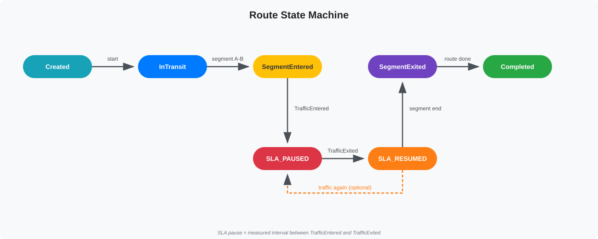

# LogiQED Architecture

## General Approach

Modular monolith on C# Blazor. Microservices are a Phase 2 concern.

For a pilot MVP, a modular monolith is the right trade-off. Natural computational boundaries are split later: telemetry ingestion, prover workers, AI execution.

## Architectural Principles

- **Modular Monolith First** - single deployment unit, modules strictly separated.
- **CQRS / MediatR** - commands change state, queries read from projections.
- **Idempotent Event Processing** - handlers safe to retry without side effects.
- **Domain Events within Modules Only** - modules communicate via interfaces, not via each other's tables.
- **Cost-Aware Design** - external APIs only when SLA exception occurs. Zero external calls in normal operation.
- **Crypto-Agility** - signatures, proof backends, hashes are pluggable.
- **Traceability** - every event traceable from ingest to permanent storage.
- **Fail-Open vs Fail-Closed Policy** - telemetry continues when Redis is down; SLA decisions persist until SQL is available.
- **Observability is not optional** - every component must expose metrics and structured logs from day one.

## Backend & Frontend

- C# Blazor Server / WebAssembly - single stack.
- ASP.NET Core - REST API, OpenAPI, webhooks.
- Entity Framework Core + MS SQL Server - operational data, analytics.
- FluentValidation - request and domain validation.
- MediatR + CQRS - command and query separation.
- SignalR - real-time updates. Redis backplane for scale-out.
- RabbitMQ - message bus for telemetry and event processing.
- Redis - hot cache, pub/sub, route state buffer.
- Seq - structured logging and tracing.
- OpenTelemetry - distributed tracing.

## Module Boundaries

| Module | Responsibility |
|--------|----------------|
| Telemetry | Device registration, position ingest, track history |
| Route | Route state machine, segment/traffic events |
| SLA | Policies, calendars, exception rules, timers |
| Evidence | Event stream, graph, package builder, trust levels |
| Identity | Device keys, attestation, revocation |
| Notifications | SignalR, webhooks, email/push |
| Dispatcher | Dashboard, manual incident resolution |

Rule: modules expose interfaces, never internal DbContexts. Shared types live in SharedKernel.

## Event-Driven Route Monitoring

### Core Idea

A route is a finite state machine, not a stream of coordinates.

Telemetry positions are normalized into route events. Each event is signed, validated, and processed through the event orchestration pipeline.

### Data Flow

Driver Browser (or Tracker App) sends Protobuf coordinate deltas with a local SHA256 chain. Payload is approximately 1 KB per packet.

Telemetry Ingest receives the stream. Normalization, deduplication, and validation are applied.

MS SQL is the system of record. Redis serves as a hot cache for fast reads.

SignalR at /hubs/telemetry delivers real-time map updates.

Event Orchestrator runs as a Background Service. It maintains the Route State Machine per route, decides whether external enrichment is required, and calls On-Demand Oracle APIs only when necessary.

SLA Engine performs deterministic calculation. Pause is the interval between TrafficEntered and TrafficExited.

Evidence Package Builder produces a compact package containing events, API response, and proof hash. Size is approximately 4 KB.

Aligned Layer generates the ZK-proof. For MVP this is mocked.

Arweave provides permanent evidence storage.

### Route State Machine

- Created, then InTransit
- InTransit, then SegmentEntered(A-B)
- SegmentEntered, then TrafficEntered, then SLA_PAUSED
- SLA_PAUSED, then TrafficExited, then SLA_RESUMED
- SLA_RESUMED, then SegmentExited(A-B)
- SegmentExited, then Completed

Rule: SLA pause is the measured interval between TrafficEntered and TrafficExited, computed in driver working calendar, not wall-clock time.

If TrafficEntered or TrafficExited falls outside working calendar, the pause is rounded to the nearest working boundary.

### Event Orchestrator

Background Service within LogiQED.Web.API for MVP. Extract to a separate microservice when scale justifies it.

Route state is owned by the Orchestrator and persisted to SQL. Redis is a read-through projection. On restart, the Orchestrator rebuilds active routes from SQL, not from Redis.

Reliability:

- Checkpoints to SQL via RouteStateSnapshots
- On restart, reprocess from last checkpoint
- Bounded Channel for backpressure

### On-Demand Oracle

External APIs are called only when an incident occurs.

- GeofenceEntered - no external API
- SegmentDelayDetected - Traffic API for the segment
- TemperatureOutOfRange - no external API, E4 sensor
- HarshBrake - no external API, accelerometer
- RouteCompleted - no external API

Rule: In normal operation, external API costs are zero.

### Enrichment Decider

Pure function that determines whether an event requires external confirmation.

Event, then Enrichment Decider, then API needed, then Yes, then One call, or No, then Skip.

### Proof Flow

SLA Engine, then Aligned Layer, then Evidence Package, then Arweave.

ZK-proof is generated only for disputed or exception-bound routes. Clean routes are closed with signed events and Evidence Root only.

Aligned Layer is the primary proof backend. For MVP, integration is mocked.

Alternative proof backends: Groth16, Plonk, STARK.

## Telemetry Subsystem

Unified infrastructure layer for ingesting, normalizing, storing and distributing mobile-object positions in real time.

### Purpose

Separates coordinate sources from business objects. Provides generic answers:

- Where is this object now?
- Which position was just received?

### Core Idea

Coordinate source, telemetry device, owner, generic position.

### Sources

- Employee browser
- Tracker application
- External tracking systems

### Device Identity

Unique pair of SourceCode + ExternalId.

### Device Owner

OwnerKind + OwnerId. Employee is built-in. Vehicles and other kinds are extensible.

### Data Model

- Last known position on device record.
- Time-ordered position track with server-configurable retention.
- Raw positions: 30 days. Aggregated 1-hour buckets: 1 year.
- Evidence packages: permanent via Arweave.

### Geofences

Geofence rules are stored server-side and pushed to the device. The device evaluates geofences locally and emits GeofenceEntered and GeofenceExited events.

### Ingestion and Normalization

- Latitude and longitude validated.
- Timestamps normalized to UTC.
- Future timestamps capped at server receive time.
- Deduplication key: DeviceId + ClientTimestampUtc + SourceSequence.
- Points ordered by recorded time.
- Known points not re-inserted.
- Late payloads extend history but cannot move current position backwards.

### Realtime Delivery

- SignalR hub /hubs/telemetry.
- TelemetryPositionReceived event.
- Dispatch map adapter translates owner key and coordinate update.

### Resilience

- Client can buffer points offline.
- Retried payloads are safe. Idempotent.
- Late data does not degrade current position.
- Redis down fallback: read from MS SQL projections.
- No connectivity at geofence boundary: events buffered and replayed with original timestamp. SLA uses event timestamp, not receive time.

### Security

- Telemetry.Read
- Telemetry.Write
- Telemetry.Report
- Tracker-ingest API uses device key, not user auth.
- Only SHA-256 hash of tracker key stored.
- Key rotation endpoint available.

### Extensibility

- New owner kinds without changing core.
- New ingest adapters without changing core.

## SLA Subsystem

Service level management with policies, calendars and exception rules.

### Components

- SLA policies: reaction and resolution targets by scope.
- Working calendars: working hours by weekday and time zone.
- Holiday sets: named non-working days.
- Exception rules: automatic penalty exclusion based on conditions.

### Policy

- Code, reaction time, resolution time, on-site arrival time.
- Calendar type: 24-7 or business hours.
- Valid from and valid to.
- Scope dimensions: category, type, priority.

### Calendar

- Time zone.
- Working hours per weekday.
- Holiday sets attached.
- Default calendar flag.

### Exception Rules

- Condition builder: field comparisons, domain conditions, AND/OR/NOT.
- Timers and escalations.
- Resulting action: chargeable delay, evidence generation.
- Rule versioning.
- Execution history.

### Integration

- SLA policies apply to shipments.
- Working calendars control timer behaviour. Evaluated in carrier timezone.
- Exception rules generate Evidence Packages.
- Rule results visible to driver as Penalty Protection.
- Golden tests for midnight, DST, holiday boundaries.

## Evidence Layer

- Signed Event Stream
- Evidence Graph
- Evidence Package
- Trust Levels E0–E5

## Event Model

LogiQED uses GS1 EPCIS 2.0 as the logistics event language.

GS1 EPCIS Event, then LogiQED Source Identity, then Signature / Attestation, then Evidence Graph, then Claim, then Proof, then Evidence Package.

LogiQED adds verifiable trust and claim evaluation on top of EPCIS.

## Trust Levels

| Level | Source |
|-------|--------|
| E0 | user input |
| E1 | authenticated external API |
| E2 | signed software source |
| E3 | attested device |
| E4 | hardware-backed + corroborated source |
| E5 | multiple independent trusted sources |

Trust Levels are not just an enum. They become Trust Policy + Provenance Graph.

Three sources are not necessarily independent. GPS and geofence may derive from the same signal.

Evidence Graph must record provenance of the source of the source.

## Hardware Attestation Research

LogiQED researches hardware proving approaches from d-inference by Layr-Labs.

Reference: https://github.com/Layr-Labs/d-inference

Key patterns:

- Secure Enclave / TEE-based key generation
- Hardware-verified attestation
- E2E encryption between client and node
- Hash-only logs

These patterns map to LogiQED trust levels E4–E5.

## Proof Engine

Pluggable proof backend.

Primary: Aligned Layer - fast, cheap ZK-verification as AVS on EigenLayer. Status: mock for MVP, integration in Phase 2.

Official developer documentation: https://docs.alignedlayer.com/

Alternatives:

- Groth16
- Plonk
- STARK

Crypto-agile architecture allows replacing proof backend without changing the product.

## Storage

MVP storage: operational event storage, canonicalization, Merkle tree, Evidence Root, external anchor, Evidence Package.

EigenDA is added only when benchmark shows the need for a separate DA layer.

### Redis

Purpose: speed, real-time, route state buffer.

Redis is an operational cache and buffer. It is not a system of record.

If Redis is empty, the system reads from MS SQL and repopulates the cache.

### MS SQL

Purpose: system of record.

Covers shipments, users, contracts, SLA rules, warehouse operations, telemetry devices, audit and analytics.

Multi-provider support: MS SQL and PostgreSQL are both available via configuration.

### Arweave

Purpose: permanent evidence.

Raw telemetry is never stored permanently. Only compact Evidence Packages, approximately 4 KB, are anchored.

## Source Identity & Trust

Minimal attestation in MVP:

- SourceId
- DeviceKey
- SourceType
- AttestationType
- TrustLevel
- KeyIssuedAt
- Firmware/AppVersion
- RevocationStatus
- EvidenceConfidence

## Observability

- Seq - structured logging.
- Correlation ID - end-to-end tracing.
- Grafana - dashboards and metrics.
- OpenTelemetry - distributed tracing.

Metrics:

- telemetry_ingested_total
- route_state_transitions_total
- sla_paused_seconds_total
- evidence_build_duration_seconds
- oracle_call_total
- rabbitmq_consumer_lag

## Error Handling & Idempotency

- Deduplication key for telemetry: DeviceId + ClientTimestampUtc + SourceSequence.
- Idempotent consumers.
- Poison message queue.
- Outbox Pattern.

Fallback Policy:

- Redis down - read from MS SQL projections.
- SQL down - telemetry buffer to filesystem, retry later.
- Oracle API down - return NoExternalData with synthetic flag, notify dispatcher.

## Testing Strategy

| Level | Scope | Tools |
|-------|-------|-------|
| Unit | SLA timer calculations, enrichment decider, FSM transitions | xUnit |
| Integration | RabbitMQ, SQL, Redis, SignalR hub | Testcontainers |
| E2E | Blazor UI, real telemetry stream, evidence package | Playwright |
| Load | 1000 devices, 1 packet/sec, check p95 | k6 |

## Scaling

- MVP: monolith with background service, one server, MS SQL.
- Phase 2: microservices for ingestion, event orchestration, prover workers.
- Phase 3: geo-distribution, own EigenDA nodes.

## Risks & Mitigations

| Risk | Mitigation |
|------|------------|
| External Oracle API becomes slow/expensive | Zero-call in normal mode |
| SQL is bottleneck | Projection tables, Redis cache |
| Device key theft | Hash storage + rotation |
| Proof backend not ready (Aligned Layer) | Mock with clear interface |
| EPCIS 2.0 too complex for MVP | Use minimal subset |
| No connectivity at geofence boundary | Events buffered and replayed |