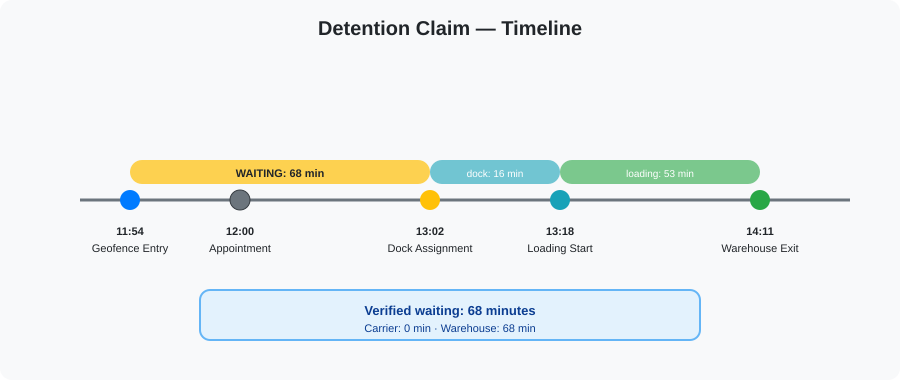

# LogiQED ZK Claims

MVP ships with two cryptographic claims.

## Claim Definition Format

Each claim follows the same structure:

- Claim ID
- Version
- Input events required
- Rule reference
- Trust Policy requirement
- Expected output
- Edge case handling
- Signature and publication

A claim is verified only with the rule version that was active at the time of the underlying events.

---

## Claim 1: Detention / Warehouse Waiting Claim

Deterministic claim based on timestamps, geofences and independent events.

### Inputs

```json
{
  "claimType": "detention",
  "version": "1.0",
  "inputs": {
    "appointmentTime": "2026-08-27T12:00:00Z",
    "geofenceEntry": "2026-08-27T11:54:00Z",
    "dockAssignment": "2026-08-27T13:02:00Z",
    "loadingStart": "2026-08-27T13:18:00Z",
    "warehouseExit": "2026-08-27T14:11:00Z"
  }
}
```



### Rule

The waiting interval is calculated from the earliest relevant timestamp to the start of loading.

In the reference example:

- Geofence entry: 11:54
- Loading start: 13:18
- Dock assignment: 13:02

Verified waiting is the interval between geofence entry and loading start.

Warehouse-attributable waiting is the interval between geofence entry and dock assignment.

Carrier-attributable waiting is the interval between dock assignment and loading start.

### Output

```json
{
  "claimId": "det-001",
  "version": "1.0",
  "result": {
    "verifiedWaitingMinutes": 68,
    "carrierAttributableMinutes": 0,
    "warehouseAttributableMinutes": 68,
    "breakdown": [
      {
        "from": "11:54",
        "to": "13:02",
        "label": "waiting_for_dock",
        "minutes": 68
      },
      {
        "from": "13:02",
        "to": "13:18",
        "label": "dock_assignment",
        "minutes": 16
      },
      {
        "from": "13:18",
        "to": "14:11",
        "label": "loading",
        "minutes": 53
      }
    ],
    "ruleId": "sla-detention-v1",
    "trustLevel": "E4"
  },
  "signature": "ed25519:...",
  "proof": "zk:..."
}
```

### Edge Cases

- Geofence crossed twice: the first geofence entry is authoritative for the claim.
- Signal lost inside geofence: loading start is taken from the first signed event after signal restoration.
- Dock assignment earlier than geofence entry: assignment is treated as occurring at geofence entry.
- Warehouse exit missing: claim can be generated with loading start as the closing boundary.
- Late payload: event timestamp is used, not server receive time.

### Verification

The claim is verified against the rule version stored in the package.

The verifier checks:

- Timestamp ordering
- Rule version
- Trust policy result
- Signature
- Proof validity

---

## Claim 2: Cargo Condition Claim

Proves that committed measurements produced by sources satisfying trust policy E4 remained within contract range during the custody interval.

### Inputs

- Measurements from E4 sources
- Contract range
- Custody interval
- Sensor tolerance

Reference example:

- Contract: 2.0–8.0 °C
- Trip: EU lane
- Tolerance: 0.1 °C

### Rule

All committed measurements must be within the contract range extended by sensor tolerance.

A measurement is valid when:

- value >= minBound - tolerance
- value <= maxBound + tolerance

The claim is VALID only when every committed measurement satisfies the rule.

### Output

```json
{
  "claimId": "cargo-temp-001",
  "version": "1.0",
  "result": {
    "status": "VALID",
    "contractRange": {
      "min": 2.0,
      "max": 8.0,
      "unit": "C"
    },
    "tolerance": 0.1,
    "statistics": {
      "min": 3.4,
      "max": 7.6,
      "avg": 4.2,
      "count": 1440
    },
    "sources": [
      {
        "sourceId": "sensor_01HZ...",
        "trustLevel": "E4"
      }
    ],
    "ruleId": "cargo-temp-v1"
  },
  "signature": "ed25519:...",
  "proof": "zk:..."
}
```

### Edge Cases

- Mixed trust levels: only E4 sources are used for the claim.
- Sensor gap: custody interval is covered only where E4 measurements exist.
- Late payload: event timestamp is used, not server receive time.
- Multiple sensors: all E4 sensors must agree within tolerance.

---

## Why These Two

- Detention claim is deterministic and easy to verify.
- Cargo condition claim covers cold chain.
- Both are valuable for settlement and insurance.