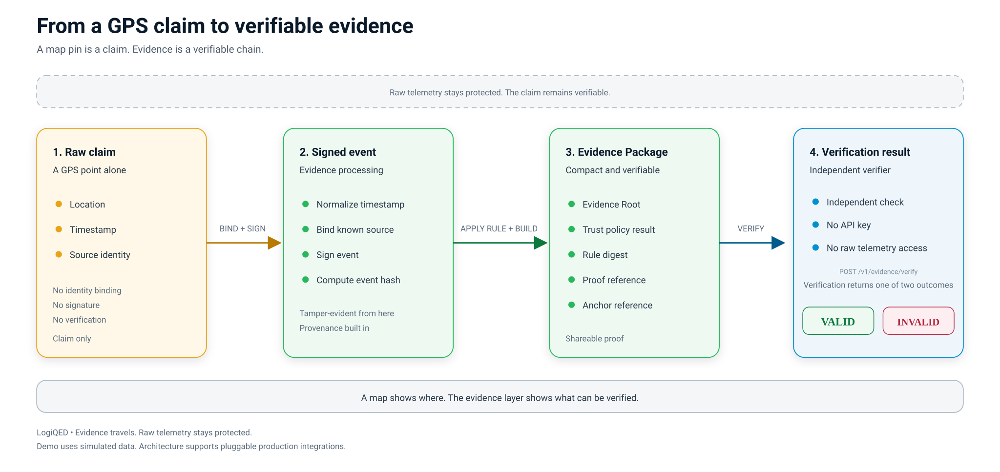

# LogiQED Evidence Package

Evidence Package is the core output of LogiQED.

It is an immutable snapshot that connects a claim, its sources, the rule that evaluated it, and the proof that verifies it.

From a GPS point to a verifiable package:



---

## Purpose

An Evidence Package exists in two forms.

**Evidence Package Base.** Produced when a claim closes, whether the claim is confirmed or rejected. Records the driver's report, the system's own data, the external API response, the computed claim level, and the final decision.

**Evidence Package Full.** Produced on dispute or audit request. Adds retroactive corroboration from independent sources, an independence check, and a ZK proof when the claim level is E3 or higher.

Clean routes without claims are closed with signed events, a Trip Evidence Root, and an Arweave anchor. No package is produced.

---

## Schema Versioning

Each Evidence Package includes schemaVersion, for example 1.0.

When the schema changes, a new version is created. Verifiers support the previous version during a transition period.

---

## Structure

Both forms share the same top-level fields. The Evidence Package Full adds corroboration, a computed claim level, and proof.

| Field | Type | Description |
|-------|------|-------------|
| schemaVersion | string | Schema version |
| packageForm | enum | BASE or FULL |
| claimId | string | Unique claim ID |
| claimVersion | string | Version of the claim definition |
| claimType | enum | DETENTION, CARGO_CONDITION, TRAFFIC, WEATHER, BREAKDOWN, WAREHOUSE_QUEUE, GEOFENCE_WAIT, BORDER_DELAY |
| timestamp | string | ISO 8601 UTC, when the package was assembled |
| driverReport | object | The driver's report at E0 |
| sources | array | Source IDs, own assurance, attestation types, role |
| trustPolicyResult | object | Policy reference, PASS or FAIL, digest |
| claimLevel | string | Computed level of the claim: E0 to E5 |
| decision | enum | CONFIRMED or REJECTED |
| corroborationResult | object | Corroborating sources and result. Present in FULL only. |
| inputEvents | array | Canonical event hashes or event IDs |
| ruleRef | object | Rule ID, version, digest |
| conclusion | object | Human-readable and machine-readable result |
| enrichmentResponse | object | External API response, present when enrichment was applied |
| proofRef | object | Proof backend, proof hash, status. Present in FULL only. |
| publicManifest | object | Privacy-minimized public summary |
| tripEvidenceRoot | string | Merkle root of all events of the route |
| claimEvidenceRoot | string | Merkle root of events related to this claim |
| externalAnchorRef | string | Arweave transaction ID |
| verifiedTimestamp | string | Timestamp when an external party verified the package. Optional. |
| signature | string | Ed25519 signature over canonical bytes |

### Base versus Full

| Field | Evidence Package Base | Evidence Package Full |
|-------|-----------------------|-----------------------|
| driverReport | Yes | Yes |
| sources | Yes | Yes |
| trustPolicyResult | Yes | Yes |
| claimLevel | Yes | Yes |
| decision | Yes | Yes |
| inputEvents | Yes | Yes |
| tripEvidenceRoot | Yes | Yes |
| claimEvidenceRoot | Yes | Yes |
| externalAnchorRef | Yes | Yes |
| corroborationResult | No | Yes |
| proofRef | No | Yes |

The Evidence Package Base is anchored as soon as the claim closes. The Evidence Package Full is anchored again when it is produced.

---

## Calculation Formula

Detention has two different values that must not be confused.

Waiting for dock is the interval between geofence entry and dock assignment. This is the warehouse-attributable interval.

Verified waiting is the interval between geofence entry and loading start. This is the total waiting interval.

For the reference example:

    dockAssignment - geofenceEntry   = 13:02 - 11:54 = 68 minutes
    loadingStart  - geofenceEntry    = 13:18 - 11:54 = 84 minutes

| Interval | Calculation | Minutes | Attribution |
|----------|-------------|---------|-------------|
| waiting_for_dock | dockAssignment - geofenceEntry | 68 | warehouse |
| transition_to_loading | loadingStart - dockAssignment | 16 | carrier |
| loading | warehouseExit - loadingStart | 53 | not counted |

The values match the SLA Engine evaluation result in [SLA DSL](SLA_DSL.md) and the claim output in [Claims](CLAIMS.md).

---

## Canonicalization and Evidence Root

Two kinds of Evidence Root exist: Trip Evidence Root and Claim Evidence Root.

**Trip Evidence Root.** Merkle root over all events of the route.

**Claim Evidence Root.** Merkle root over events related to one claim.

The Claim Evidence Root is a subtree of the Trip Evidence Root. Both are anchored separately.

### Canonicalization Steps

To compute a stable Evidence Root:

1. Each event is normalized.
2. Fields are sorted alphabetically.
3. Timestamps are UTC, ISO 8601.
4. Number precision is fixed.
5. No whitespace.
6. Each normalized event is hashed with SHA-256.
7. Hashes are sorted by byte value.
8. A Merkle tree is built over sorted hashes.
9. The root is the Merkle root.

The same canonicalization is used for the package signature.

### Canonical Event Example

```json
    {
      "eventType": "TelemetryPosition",
      "sourceId": "TRK-GPS-01",
      "eventTime": "2026-09-22T10:00:00Z",
      "position": { "lat": 52.5200, "lon": 13.4050 },
      "speed": 2,
      "accuracy": 15,
      "sourceSequence": 4721,
      "signature": "..."
    }
```

---

## Storage in MS SQL

The Evidence Builder writes to the following tables.

| Table | Content | When |
|-------|---------|------|
| Events | Raw events of the route | On ingest |
| EventHashes | SHA-256 of each event | On ingest |
| MerkleNodes | Intermediate Merkle nodes | On route or claim close |
| EvidenceRoots | Trip and claim roots | On close |
| EvidencePackages | Evidence Packages Base and Full | On claim close or dispute request |
| Anchors | Arweave transaction IDs | After anchor |

---

## Provenance Chain

The package references an Evidence Graph.

Claim, Events, Sources, Source-of-Source, Rule, Proof.

Each node in the graph is hash-linked.

The Evidence Graph is also used to check independence between sources for corroboration.

---

## Storage

| Store | Content | Retention |
|-------|---------|-----------|
| MS SQL | Operational events, claims, rules, audit | Raw positions: 30 days. Aggregates: 1 year. Claims: permanent |
| Redis | Hot cache for active routes | Active route lifetime |
| Arweave | Trip and claim anchors | Permanent |
| Deletable storage | Raw encrypted context data | Deletable on request |

Raw telemetry is never stored permanently.

---

## Privacy Design

Permanent storage contains commitments and proofs, not raw telemetry.

Public Manifest excludes:

- Driver name
- Vehicle plate
- Exact GPS coordinates of stops

Public Manifest includes:

- Claim type
- Conclusion summary
- Claim level
- Evidence Roots
- Rule reference
- External anchor

Raw encrypted context data is stored separately in deletable storage.

Deleting raw data or destroying keys does not remove the cryptographic proof that the package existed and was verified.

---

## Signature

The package is signed by the organization key, not a device key.

Algorithm: Ed25519, hybrid with ML-DSA, crypto-agile.

Proof backend is pluggable: Aligned Layer, Groth16, Plonk, STARK, or zkVM options (Lattice Jolt, SP1, RISC Zero). See [Architecture](ARCHITECTURE.md) for the proof pipeline.

---

## Verification

An external party can verify without raw telemetry.

Checks:

- Signature against known organization public key
- Trip Evidence Root matches canonical hash of route events
- Claim Evidence Root matches canonical hash of claim events
- Rule reference digest matches published rule definition
- Trust policy result matches source own assurance values
- Claim level matches the computed level
- Conclusion matches rule formula and input events
- ZK-proof when present in Evidence Package Full

---

## Lifecycle

1. Created - package assembled from inputs, no anchor.
2. Signed - organization key signs canonical bytes.
3. Anchored - package and Evidence Roots sent to Arweave.
4. Verified - external party checks the package. Optional and only on dispute, audit, or settlement.
5. Retired - raw deletable context deleted, proof package remains.

For the Evidence Package Full, steps 1 to 3 are repeated with corroboration and proof.

---

## Size Budget

Evidence Package Base: approximately 2 KB.

Evidence Package Full: approximately 4 KB.

Breakdown for Evidence Package Full:

- JSON metadata: about 1 KB
- Event hashes: about 0.5 KB
- Rule and trust policy: about 0.5 KB
- Signature: about 0.1 KB
- ZK-proof reference: about 1.5-2 KB

---

## Example: Confirmed Claim

Detention package, confirmed.

- Claim: Detention
- Claim level: E4
- Decision: CONFIRMED
- Conclusion: Warehouse attributable: 68 min
- Rule: DETENTION_V1
- Trust Policy: E4_REQUIRED_V1
- Result: PASS
- Proof: VALID (Evidence Package Full)
- Trip Evidence Root: 0x8f3a...
- Claim Evidence Root: 0x4b12...
- Arweave Transaction: kT4b...

## Example: Rejected Claim

Traffic claim, rejected.

- Claim: Traffic
- Claim level: E1
- Decision: REJECTED
- Conclusion: No congestion detected on segment. SLA continues.
- Rule: TRAFFIC_PAUSE_V1
- Trust Policy: E2_REQUIRED_V1
- Result: FAIL
- Proof: not available (claim level below E3)
- Trip Evidence Root: 0x8f3a...
- Claim Evidence Root: 0x7c91...
- Arweave Transaction: kT4b...

A rejected claim is still recorded and anchored. The driver may review it later. The package shows why the claim was rejected.

---

## Design Notes

- Each step is signed and hashable.
- Raw telemetry stays in the operational store with retention.
- Permanent layer contains commitments and proofs, not raw telemetry.
- Any step can be independently audited.
- All consumers are idempotent.
- Clean routes close with signed events and Evidence Root only.
- An Evidence Package Base is produced for every claim, confirmed or rejected.
- An Evidence Package Full is produced only on dispute or audit request.
- ZK proof is added only when the claim level is E3 or higher.

---

## Related

- [Evidence Flow](EVIDENCE_FLOW.md) - when each evidence level is generated
- [Claims](CLAIMS.md) - claim definitions
- [Trust Levels](TRUST_LEVELS.md) - source assurance levels
- [Data Flow](DATA_FLOW.md) - event pipeline from ingest to verification
- [Evidence Builder](EVIDENCE_BUILDER.md) - implementation specification