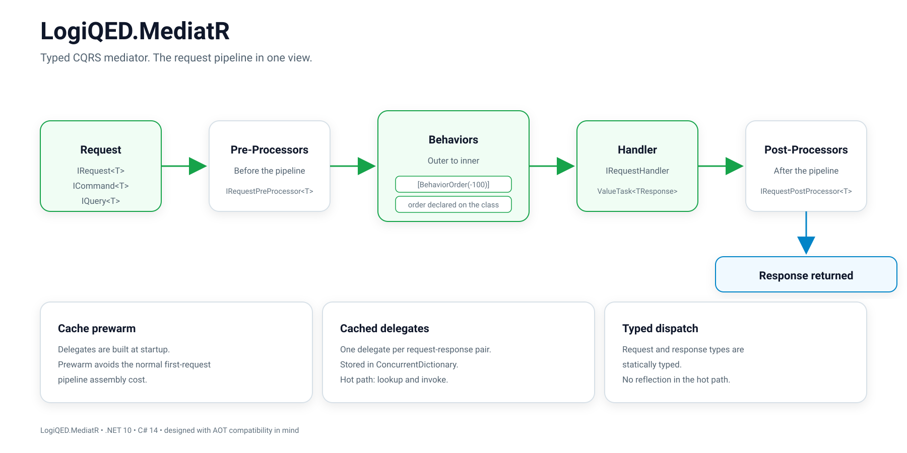

# LogiQED.MediatR

## What It Is

A custom mediator implementation for internal CQRS exchange in the LogiQED solution.

Fully replaces the MediatR package.



---

## Architecture

### Contracts

Several independent message families, each with its own pipeline:

| Family | Request | Handler | Pipeline |
|--------|---------|---------|----------|
| Request with response | `IRequest<TResponse>` | `IRequestHandler<TRequest, TResponse>` | `IRequestPipelineBehavior<TRequest, TResponse>` |
| Command | `ICommand<TResponse>` | same | `CommandBehavior` and any narrowed to `ICommand<>` |
| Query | `IQuery<TResponse>` | same | `QueryBehavior` and any narrowed to `IQuery<>` |
| Notification | `INotification` | `INotificationHandler<TNotification>` | `INotificationPipelineBehavior<TNotification>` |
| Stream | `IStreamRequest<TResponse>` | `IStreamRequestHandler` | `IStreamPipelineBehavior` |

Additional:

- `IRequestPreProcessor<TRequest>` and `IRequestPostProcessor<TRequest, TResponse>` — steps before and after the pipeline
- `ISaga<TData>` — process step with a `CompensateAsync` rollback method

### Dispatch

For a request-response pair, a delegate is built once:

```csharp
Func<IServiceProvider, TRequest, CancellationToken, ValueTask<TResponse>>
```

Inside the delegate, the full chain is already folded: pre-processors, then behaviors from outer to inner, then the handler, then post-processors.

The delegate is stored in a `ConcurrentDictionary` and reused on all subsequent calls. After that, `SendAsync` is a dictionary lookup and a delegate invocation.

### Registration

`AddMediatRModule(assemblies)` scans assemblies in a single pass and registers handlers, behaviors, validators, and processors — including open generic types. No manual registration per handler is required.

### Prewarm

A hosted service calls `PrewarmCacheAsync` at application start and builds delegates for all discovered `IRequest<>` types. The first request after deployment pays nothing for pipeline assembly.

---

## Advantages over MediatR

### 1. ValueTask Throughout the Chain

All contracts — handler, behavior, processor — return `ValueTask` or `ValueTask<T>`.

MediatR is built on `Task`. The difference shows where a handler completes synchronously: cache reads, permission denials, short validation failures. On those paths, `Task` allocates on the heap every time; `ValueTask` does not.

### 2. Fully Typed Dispatch

`SendAsync<TRequest, TResponse>` receives both types statically, at compile time. MediatR accepts `IRequest<TResponse>` and determines the handler type at runtime — through a reflection-built wrapper and a virtual call through a non-generic base class.

Consequences:

- No `dynamic` and no reflection-built wrapper.
- A non-existent request-response pair does not compile, rather than failing at runtime.
- "Go to implementation" from the call site leads directly to the handler.

### 3. Behavior Order Is Declared by the Behavior Itself

`[BehaviorOrder(-100)]` sits on the class next to what the class does. In MediatR, order is the registration order in the container — set at the composition point and not visible from the behavior.

Practical difference: a new module registering its own behavior cannot accidentally run before request validation. Order is read where the behavior code is written, not in the startup file.

### 4. Notification Publish Strategy Is Chosen per Notification Type

Four strategies:

- `Sequential`
- `Parallel`
- `ParallelNoWait`
- `StopOnError`

And a provider:

```csharp
INotificationPublishStrategyProvider.StrategyFor<TNotification>()
```

It selects the strategy by notification type. MediatR 12 has `INotificationPublisher`, but it is set once for the entire application.

The difference is significant: notification broadcast and audit-record write do not have to obey the same error-handling rule.

### 5. A Subscriber Failure Does Not Cancel the Others

This is a decision, not an accident.

`Sequential` executes all subscribers, collects exceptions, and throws an `AggregateException` at the end: one failed listener does not deprive the event of the others. When the opposite is required, `StopOnError` is available — it stops on the first error.

### 6. Command and Query Are Separated at the Type Level

`ICommand<T>` and `IQuery<T>` are different contracts. A behavior narrowed to `ICommand<>` applies only to commands. A cross-cutting rule is expressed as a generic type constraint, not as an `if (request is ...)` check inside a shared behavior.

In MediatR, the contract is single: `IRequest<T>`.

---

## Summary

| Aspect | MediatR | LogiQED.MediatR |
|--------|---------|-----------------|
| Return type | `Task` | `ValueTask` |
| Dispatch | Runtime reflection | Compile-time typed |
| Behavior order | Registration order | `[BehaviorOrder]` attribute |
| Publish strategy | One per app | Per notification type |
| Subscriber failure | Cancels others | Configurable |
| Command vs query | Same contract | Separate contracts |
| Cold start | No prewarm | Cache prewarm at startup |
| Registration | Manual or reflection scan | Assembly scan via `AddMediatRModule` |

---

## Runtime

- .NET 10
- C# 14
- No reflection in the hot path
- AOT-compatible design
- `ConcurrentDictionary` for delegate cache

---

## Related

- [Architecture](ARCHITECTURE.md)
- [Platform](PLATFORM.md)
- [README](../README.md)