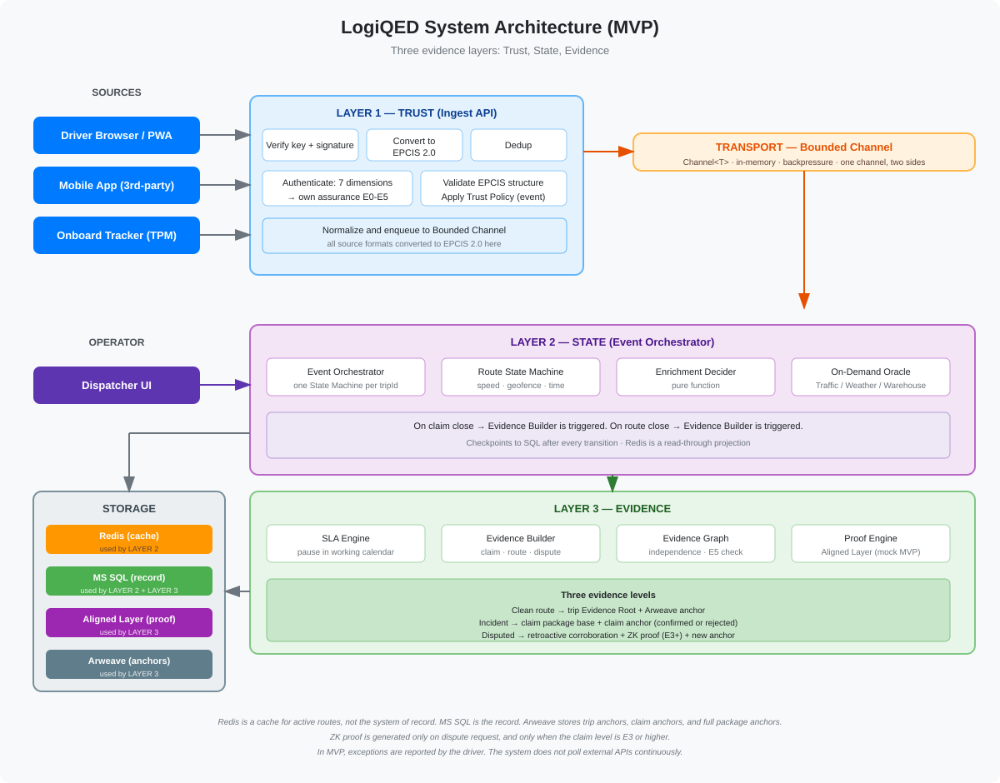

# LogiQED Platform

Production-grade C# Blazor platform for logistics and verifiable freight infrastructure.

## Executive Summary

From 9 July 2027, every European logistics company must accept electronic freight transport information, eFTI, as the default.

LogiQED turns this obligation into competitive advantage through verifiable evidence infrastructure with ZK proofs.

LogiQED is the only platform connecting eFTI compliance, ZK proofs, and post-quantum security on one enterprise-grade C# foundation.

The European eFTI compliance software market is projected to reach €2.4B by 2027.

We are a senior engineering team from Ukraine with a production-ready platform: 120+ projects, 1,300+ tests, 330+ tables.

## What It Is

A complete operational platform, not a prototype or MVP.

Built for real business processes: shipments, SLA, telemetry, warehouse, documents, communication and reporting.

The platform is the foundation for two products:

- LogiQED — Verifiable Freight Infrastructure
- PowerQED — Verifiable Energy Infrastructure, blueprint stage

Both products reuse the same C# Blazor core: SLA engine, workflow, auth, admin panel, telemetry, reporting.

## Platform Metrics

- 120+ projects in solution
- 1,300+ tests
- Web.UI.Tests: 400+ tests
- Omnichannel.Tests: 160+ tests
- 330+ tables in the domain model

## Architecture Overview

Modular monolith on C# Blazor / ASP.NET Core.

Modules communicate through interfaces, never through each other's database tables. Shared types live in SharedKernel.

See [ARCHITECTURE.md](ARCHITECTURE.md) for full details.

## Product Status

| Component | Status |
|-----------|--------|
| Core platform | Production-ready |
| Evidence Layer | MVP stage |
| ZK Claims | MVP stage |
| Lean 4 formal verification | Research |
| Post-quantum signatures | Hybrid: Ed25519 + ML-DSA |
| PowerQED | Blueprint only |

## Database

Large enterprise database with a wide domain model. 330+ tables.

Multi-provider support:

- MS SQL Server
- PostgreSQL

## Core Modules

### Workflow Engine

Fully configurable from admin panel.

### SLA Engine

SLA policies, working calendars, holiday sets, exception attribution rules.

### Hybrid Authentication and Authorization

Stateful JWT with server sessions, 2FA, trusted devices, refresh rotation, RBAC and permissions.

### Admin Panel

User, role and permission management. Audit journal. Role-based UI. No hardcoded roles.

### Telemetry Subsystem

Position sources: browser, tracker app, external systems.

Device identity: SourceCode + ExternalId.

### Warehouse Operations

- Receipts, issues, transfers, write-offs
- Turnover sheet
- Approval workflows
- Transit warehouse support

### Shift Management

- Shift scheduling and handover
- Incident registry per shift
- Supervisor controls

### Reporting Engine

Export to PDF, CSV, XLSX. 200,000 rows × 60 columns in 5 seconds.

### Evidence Layer

- Signed Event Stream
- Evidence Graph
- Evidence Package
- Trust Levels E0–E5
- Hybrid signatures: Ed25519 + ML-DSA
- Hashing: SHA-256, BLAKE3

### Route Monitoring

- Route State Machine
- TrafficEntered and TrafficExited events
- Event Orchestrator
- On-Demand Oracle

### Lean 4 Formal Verification

Machine-checked proofs for claim rules and SLA mathematics.

Example property: "If SLA deadline expires, exception attribution rule applies at most once."

Roadmap: penalty calculation and exception handling in Phase 2.

Using Mathlib standard library.

Official repository: https://github.com/leanprover/lean4

## Post-Quantum Readiness

Hybrid signatures: Ed25519 + ML-DSA.

Implemented with BouncyCastle and NSec.

Crypto-agile architecture.

Following SNARK.fast for post-quantum proof verification on x86/Linux.

## Security

- Private keys stored in HSM such as Azure Key Vault
- Multisignature for smart contract management
- Cold and hot wallet separation
- AES-256 at rest, TLS 1.3 in transit

## Proof Engine

Primary: Aligned Layer. Fast, cheap ZK-verification as AVS on EigenLayer.

STARK (FRI) is the primary scheme in MVP because it is post-quantum secure. It relies only on hash functions, not pairing-based cryptography that quantum computers can break. Groth16 and PLONK are kept as fallback due to their lower verification cost on L1.

Estimated cost: $0.01–0.05 per shipment.

Fallback: Groth16 or Plonk.

Official documentation: https://docs.alignedlayer.com/

## AI Integration

Research direction, not part of MVP.

The platform is AI-ready: OpenAPI, webhooks, semantic tags.

Why AI matters for our clients: mid-sized carriers lose time and money on manual ETA updates and dispute paperwork. AI can automate both.

Future possibilities post-MVP:

- ETA prediction from telematics
- Anomaly detection in route execution
- Document extraction from freight documents

How we will integrate: via OpenRouter API or a decentralized cluster such as Darkbloom, with models exported through ONNX Runtime.

Why we are watching Darkbloom: they are building a network of Macs, and soon x86/Linux, for cheap inference. If their Linux support matures, we can run open-weight models at a fraction of centralized API cost.

The same AI module will later serve PowerQED use cases: load prediction and energy theft detection, creating a second revenue stream.

Status: research. Not in MVP scope. MVP focuses on evidence and ZK claims.

## Business Model

See [BUSINESS_MODEL.md](BUSINESS_MODEL.md) for full details.

Key pricing:

- SaaS subscription: $99/month + $10/vehicle for Pro plan.
- Per-evidence-package: $0.08 (Pro), $0.05 (Enterprise).
- Cost per package: $0.01–0.03.
- Gross margin: 70–85%.

## Why Now

From 9 July 2027, EU authorities must accept electronic freight transport information as the default.

eFTI certification planned for 2026 according to Regulation (EU) 2020/1056.

## Competitors

| Competitor | Why LogiQED |
|-----------|-------------|
| SAP, Oracle TM | No ZK proofs, no trust levels, no post-quantum readiness |
| VeChain, Chronicled | No SLA engine, no enterprise C# |
| Manual arbitration | Slow, costly, subjective |

## Go-to-Market

- Pilot with one European carrier, see [PILOT.md](PILOT.md)
- eFTI compliance as entry point
- Early adopter program for 10–20 carriers on Starter plan
- Insurance API integrations
- Marketplace later

## Token and Ecosystem

The team does not claim any token rights and does not build the token.

Investors are welcome to launch and list the token as they see fit.

The team is not against token launch. We welcome it and support it technically where needed.

Token development and listing are on the investor's side.

If the investor launches a token, the team receives 15% of the token allocation.

Token utility can include:

- Discounts on evidence fees
- Staking for SLA guarantees with slashing
- Payment for Aligned Layer fees with DEX conversion
- Governance of subsidized evidence types

Slashing scenario: if a node operator fails to provide proof within N blocks, stake is slashed via smart contract. Violations are objectively determined by telemetry and verifiers.

## Team

Senior engineering team from Ukraine.

- Starts with 5–6 senior .NET developers
- Scales to 8–10 engineers from month 2
- 15+ years in C# / .NET
- Worked together on logistics and cloud systems
- Comfortable with crypto, ZK, blockchain
- Experience with smart contracts and ZK circuits
- Resumes on request

## Technical Marketing

LogiQED Labs — technical Twitter account.

- Architecture deep dives
- ZK in logistics
- C# / Blazor engineering
- MVP progress

Plus technical blog on Medium and Dev.to.

## Transparency

The entire development process is visible in Azure DevOps:

- Backlog and tasks
- Active bugs and their status
- Burndown charts
- Test results and coverage
- Sprint planning

Investor dashboard is read-only.

Full repository access after NDA for technical due diligence.

The investor can watch the project move in real time.

## Risks and Mitigations

| Risk | Mitigation |
|------|------------|
| Missing eFTI deadline | Pilot Q1 2026, parallel compliance |
| Aligned Layer availability | Fallback to Groth16 or Plonk |
| ZK cost increase | Monitoring, batching, SNARK.fast |
| Quantum breakthrough | Hybrid signatures, crypto-agile |
| Conservative adoption | Pilot carrier, TMS integration |
| Team capacity | Scalable team, phased delivery |
| Legal or regulatory delay in eFTI | Focus on voluntary SLA disputes first |

## Deal Options

### Option 1: Full Acquisition

Price: Starting at $350K. Negotiable.

Full transfer including source code, deployment scripts, CI/CD pipelines, marketing assets, and all registered domain names.

### Option 2: Team + Platform + Equity

The team invests 50% of the $350K valuation into the project.

Remaining for the investor: $175K.

| Parameter | Value |
|-----------|-------|
| Platform fee | 40% of $175K = $70K, paid upfront |
| Remaining platform value | 60% of $175K = $105K, after MVP |
| MVP development | $170–200K USDT, estimated |
| Team | 5–6 engineers, scalable to 8–10 |
| Equity | 15% |
| Token allocation | 15%, if launched |

Minimum investor commitment to start: $70K upfront + $35–40K first month of work = $105–110K.

Final price depends on the approved MVP scope and team composition.

MVP scope: Evidence Layer, ZK Claims, Route Monitoring, telemetry dashboards. AI and Lean 4 are explicitly out of scope.

See [MVP.md](MVP.md) for full scope.

Payment flexibility for MVP:

- 50% of MVP cost upfront, 50% after MVP
- 80% upfront, 20% after MVP
- 100% upfront: 10% discount and priority start within 1 week

After MVP: the team continues at the same monthly rate of $35–40K. The investor can reduce or expand the team based on roadmap priorities. If the investor stops development, a 2-month handover period ensures smooth transition.

The team manages development. The investor covers infrastructure.

All payments in USDT.

Code transfer after full platform payment. Until then, the code remains with the team.

The investor has full visibility through Azure DevOps.

## Timeline

| Phase | When | What |
|-------|------|------|
| Month 1 | Q1 2026 | Infrastructure setup, test environment |
| Month 2 | Q1 2026 | Evidence Layer, Aligned Layer mock |
| Month 3 | Q2 2026 | ZK Claims, route monitoring, telemetry integration |
| Month 4 | Q2 2026 | Pilot launch with one carrier, documentation, handover |
| Pilot run | Q3 2026 | 3–6 months pilot, first paying contract by Q4 2026 |
| Phase 2 | Q3 2026 | Aligned Layer, attestation, insurance API, Lean 4, AI |
| eFTI | July 2027 | Compliance tooling ready |

## Contact

Email: LogiQED@gmail.com

- [X / Twitter](https://x.com/LogiQED)
- [GitHub](https://github.com/logiqed/LogiQED)

Domain: logiqed.tech

---

## More Details

- [PLATFORM](PLATFORM.md)
- [BUSINESS_MODEL](BUSINESS_MODEL.md)
- [MVP](MVP.md)
- [PILOT](PILOT.md)
- [ARCHITECTURE](ARCHITECTURE.md)