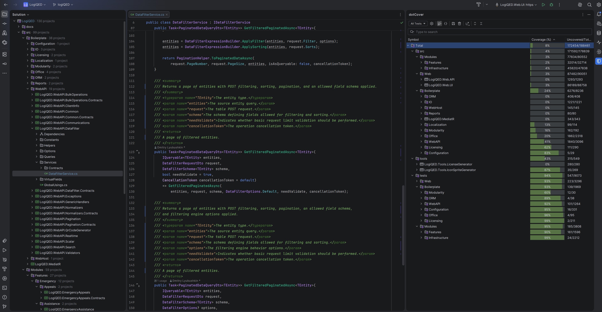
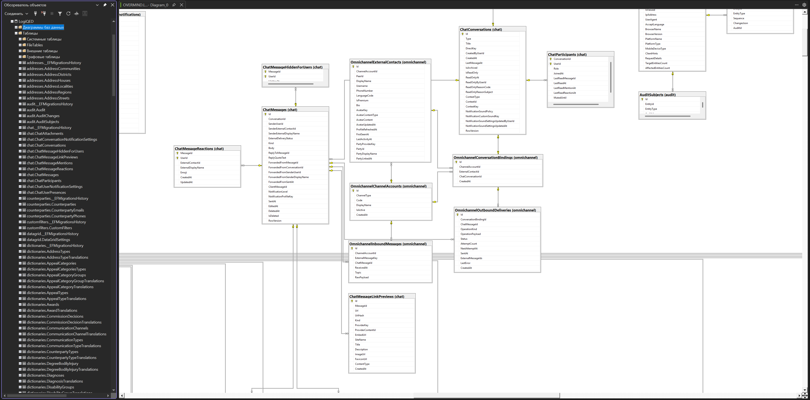

# LogiQED Platform

Production-grade C# Blazor platform for logistics and verifiable freight infrastructure.

## What It Is

A complete operational platform, not a prototype or MVP.

Built for real business processes: shipments, SLA, telemetry, warehouse, documents, communication and reporting.

The platform is the foundation for two products:

- LogiQED — Verifiable Freight Infrastructure
- PowerQED — Verifiable Energy Infrastructure, blueprint stage

Both products reuse the same C# Blazor core: SLA engine, workflow, auth, admin panel, telemetry, reporting.

## Platform Metrics

- 120+ projects in solution
- 1,300+ tests
- Web.UI.Tests: 400+ tests
- Omnichannel.Tests: 160+ tests
- 330+ tables in the domain model

## Platform Screenshot

Solution Explorer, Test Explorer, code and build output.

## Product Status

| Component | Status |
|-----------|--------|
| Core platform | Production-ready |
| Evidence Layer | MVP stage |
| ZK Claims | MVP stage |
| Lean 4 formal verification | Research |
| PowerQED | Blueprint only |

## Database

Large enterprise database with a wide domain model. 330+ tables.

Multi-provider support:

- MS SQL Server
- PostgreSQL

Provider is selected via configuration. No code changes required to switch.

Connection strings are environment-based.

## Core Modules

### Workflow Engine

Fully configurable from admin panel. Any business process can be modeled without code changes.

### SLA Engine

SLA policies, working calendars, holiday sets, exception attribution rules.

### Hybrid Authentication and Authorization

Stateful JWT with server sessions, 2FA, trusted devices, refresh rotation, RBAC and permissions.

### Admin Panel

User, role and permission management. Rules and endpoint configuration. Audit journal.

Role-based UI construction: navigation and screens are generated from permissions.

No hardcoded roles. The same platform adapts to any organizational structure.

### Telemetry Subsystem

Unified infrastructure layer for ingesting, normalizing, storing and distributing mobile-object positions in real time.

Separates coordinate sources from business objects. Provides generic answers:

- Where is this object now?
- Which position was just received?

Position sources:

- Employee browser with high-accuracy geolocation
- Tracker application for background reporting with screen off
- External tracking systems through APIs, webhooks or device protocols

Device identity:

- Unique pair of SourceCode + ExternalId
- Automatic device discovery from first accepted position stream
- Tracker keys issued by administrator, stored as hash only

Device owners:

- OwnerKind + OwnerId
- Built-in Employee kind
- Extensible to vehicles and other domain objects

Data model:

- Last known position on device record
- Time-ordered position track with server-configurable retention
- Raw positions: 30 days
- Aggregates: 1 year

Ingestion and normalization:

- Latitude and longitude validated
- Timestamps normalized to UTC
- Future timestamps capped at server receive time
- Duplicate timestamps removed
- Points ordered by recorded time
- Known points not re-inserted
- Late payloads extend history but cannot move current position backwards

Resilience:

- Client can buffer points offline
- Retried payloads are safe
- Late data does not degrade current position
- Redis down fallback: read from MS SQL projections
- No connectivity at geofence boundary: events buffered and replayed

Realtime delivery:

- SignalR hub /hubs/telemetry
- TelemetryPositionReceived event
- Dispatch map adapter translates owner key and coordinate update

Access control:

- Telemetry.Read
- Telemetry.Write
- Telemetry.Report
- Tracker-ingest API uses device key, not user auth
- Only hash of tracker key stored
- Key rotation endpoint available

Administration:

- Telemetry-device registry with filtering, sorting, paging
- Owner assignment, reporting control, tracker key issuance, deletion
- Server-side blocking enforcement

Extensibility:

- New owner kinds without changing core
- New ingest adapters without changing core

### Warehouse Operations

Receipts, issues, transfers, write-offs, turnover sheet.

### IP Telephony

Abstract module with Callaway integration.

### Reporting Engine

Custom reporting engine with export to PDF, CSV, XLSX.

Performance: 200,000 rows × 60 columns exported to Excel in 5 seconds.

### Mass Edit

Bulk editing of entities across the platform.

### Advanced Filters

Flexible filter builder with nested conditions and AND/OR combinations. Filters are saved per user.

### Evidence Layer

- Signed Event Stream
- Evidence Graph
- Evidence Package
- Trust Levels E0–E5

### Route Monitoring

- Route State Machine
- TrafficEntered and TrafficExited events
- Event Orchestrator as Background Service
- On-Demand Oracle

### Lean 4 Formal Verification

- Machine-checked proofs for claim rules and SLA mathematics
- Research only, not part of MVP delivery
- Official repository: https://github.com/leanprover/lean4

## Why Now

From 9 July 2027, EU authorities must accept electronic freight transport information, eFTI, as the default.

LogiQED is positioned as evidence infrastructure on top of eFTI.

## Proof Engine

Primary proof backend: Aligned Layer. Fast, cheap ZK-verification as AVS on EigenLayer.

Status: mock for MVP, integration in Phase 2.

Official developer documentation: https://docs.alignedlayer.com/

Alternatives: Groth16, Plonk, STARK, Flock.

## Hardware Attestation Research

LogiQED researches hardware proving approaches from d-inference by Layr-Labs.

Reference: https://github.com/Layr-Labs/d-inference

The same model is used for LogiQED trust levels E4–E5.

## Deal Options

### Option 1: Investment for MVP

Budget: $170–200K.

Timeline: 3–4 months.

The platform is reused as the foundation. Evidence layer is added on top.

Founder stays and builds the product.

### Option 2: Full Acquisition

Price: Starting at $350K. Negotiable.

Full transfer of code, brand, domain, GitHub, X account and documentation.

Buyer receives the complete platform and can build any logistics or operational product on top.

Final terms depend on due diligence. Non-disclosure agreement required before sharing additional details.

## Contact

For investment, acquisition or pilot partnership:

Email: LogiQED@gmail.com

- [X / Twitter](https://x.com/LogiQED)

- [GitHub](https://github.com/logiqed/LogiQED)

Domain: logiqed.tech