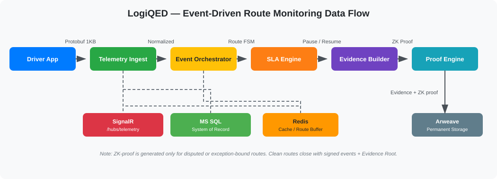

# LogiQED

**Verifiable Freight Infrastructure.**

LogiQED is the cryptographic evidence layer for physical logistics.

A truck arrives at the warehouse. Geofence entry 11:54. Dock assignment 13:02. Loading start 13:18. Warehouse exit 14:11.

Verified waiting: 68 minutes. Warehouse attributable: 68 minutes. Carrier attributable: 0 minutes.

Disputes close on evidence, not on negotiation.

---

## The Result

A late truck is explained by data:

> Arrival 14:37, ETA 13:55, delay 42 min. Cause: traffic between A-B. Telemetry clean, events signed, hashes match, SLA rule v3, no penalty.

One Evidence Package costs about $0.08. One SLA dispute costs $200–500.

One won dispute pays for months of subscription.

---

## How It Works

Sensor/device, attestation, timestamp, signature, provenance, Evidence Package.

  

---

## What LogiQED Provides

- **Signed Event Stream** - authenticated trip events from devices, APIs, and sources.
- **Trust Levels E0–E5** - graded confidence for every source.
- **Evidence Graph** - provenance DAG connecting events, sources, and rules.
- **SLA Engine** - rule execution with automatic exception attribution.
- **Route State Machine** - TrafficEntered pauses SLA, TrafficExited resumes it.
- **On-Demand Oracle** - external APIs called only when an incident occurs.
- **Evidence Package** - immutable snapshot of claim, proof, and context.
- **Role-based UI** - navigation and screens generated from permissions.

---

## First Two Claims

### 1. Detention / Warehouse Waiting

- Appointment 12:00, geofence entry 11:54, dock assignment 13:02, loading start 13:18, exit 14:11.
- Result: warehouse attributable 68 minutes.

### 2. Cargo Condition

- Contract 2–8°C, EU lane, temperature stayed in range.
- Proof: VALID.

---

## EPCIS and eFTI

LogiQED uses **GS1 EPCIS 2.0** - the international logistics event language.

A truck entering a geofence, a temperature breach, a loading start - every event is recorded in a format that eFTI platforms understand.

When eFTI becomes mandatory for EU authorities on 9 July 2027, LogiQED Evidence Packages will already be in the correct format. No rework needed.

---

## Tech Stack

C# Blazor, MS SQL, Redis, RabbitMQ, SignalR, Aligned Layer, Arweave.

Privacy-by-design. GDPR compliant.

Post-quantum ready: hybrid signatures Ed25519 + ML-DSA.

Source code is private. Access after NDA.

  

---

## Team

Senior engineering team from Ukraine.

- [Borys Mulev](https://www.linkedin.com/in/borysmulev/) - Senior C#/.NET Engineer
- [Marenich](https://www.linkedin.com/in/marenich/) - Senior Engineer

15+ years in C# / .NET. Worked together on logistics and cloud systems.

Additional team members: resumes on request.

---

## Why Now

From 9 July 2027, EU authorities must accept regulatory freight information submitted electronically through certified eFTI platforms.

Official regulation: [Regulation (EU) 2020/1056](https://eur-lex.europa.eu/legal-content/EN/TXT/?uri=CELEX%3A32020R1056)

---

## Status

Core platform production-ready. Evidence Layer and claims are in MVP development.

**Demo available.** 32 screens, 6 roles, credentials included.

Live walkthroughs available on request.

Contact: LogiQED@gmail.com | [X / Twitter](https://x.com/LogiQED)

---

## For Investors

- [Investor Document](INVESTORS.md) - team, deal options, budget
- [Business Model](BUSINESS_MODEL.md) - pricing and economics
- [MVP](MVP.md) - 16-week plan and budget
- [Pilot](PILOT.md) - proving value with real trucks
- [Platform](PLATFORM.md) - full platform details

---

## Docs

- [Vision](VISION.md)
- [Architecture](ARCHITECTURE.md)
- [Trust Levels](TRUST_LEVELS.md)
- [Claims](CLAIMS.md)
- [Evidence](EVIDENCE.md)
- [Ingest API](INGEST.md)
- [Webhooks](WEBHOOKS.md)
- [Verification](VERIFY.md)
- [SLA DSL](SLA_DSL.md)
- [UI Demo](UI_DEMO.md)
- [UI MVP](UI_MVP.md)
- [Data Flow](DATA_FLOW.md)
- [Security](SECURITY.md)
- [Authorization](AUTHORIZATION.md)
- [Glossary](GLOSSARY.md)
- [Development Process](DEVELOPMENT.md)
- [OpenAPI](OPENAPI.yaml)
- [ADR 0001](adr/0001-modular-monolith.md)
- [ADR 0002](adr/0002-storage-and-commitments.md)

---

## More

- [Roadmap](ROADMAP.md)
- [FAQ](FAQ.md)
- [Contributing](CONTRIBUTING.md)
- [Changelog](CHANGELOG.md)
- [X / Twitter](https://x.com/LogiQED)
- [License](../LICENSE.md)

---

## Future Directions

Research and exploration beyond the core evidence layer.

Marketplace, DePIN, scientific sensors, soulbound reputation, security modules, HD maps, AI agents.

- [Future Product Ideas](../research/potential/README.md)