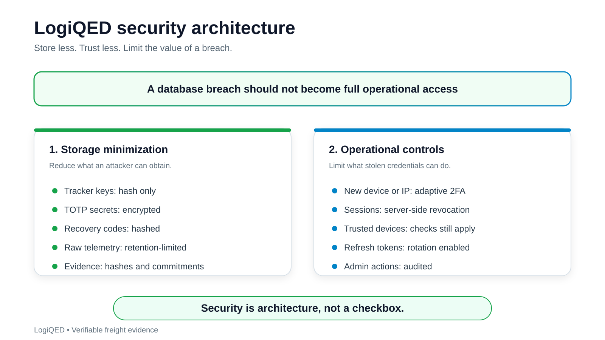

# Security

## Roles and Access Matrix

LogiQED uses fully configurable roles and permissions.

The role-based access model allows creating any role with any combination of permissions. There are no hardcoded roles.

Default demo roles:

| Role | Access |
|------|--------|
| Administrator | Full access: users, roles, permissions, audit |
| SLA Analyst | SLA policies, calendars, incidents |
| Dispatcher | Registry, Map, Incidents, Workflow, Claim Packages |
| Driver | Mobile driver view, Telemetry, Incidents |
| Shift Supervisor | Org structure: departments, employees, duty roster |
| Auditor | Claim Packages, Trust sources, Audit Journal |

Any custom role can be created from the admin panel.

Navigation, screens, and backend endpoints are generated from effective permissions.

Implemented via JWT for operator UI and X-Telemetry-Key for trackers.

## Key Management

### Key Generation

- Device keys are generated on the device.
- Keys are not exported in plaintext.
- Only SHA-256 hashes of tracker keys are stored server-side.

### Onboarding

1. Device generates a key pair on board.
2. Sends PublicKey, DeviceModel, FirmwareVersion to the admin API.
3. Admin confirms the device manually or via serial list.
4. Server returns SourceId and KeyId.
5. Device signs events.

### Rotation

- Device keys rotate every 90 days.
- API keys rotate immediately on suspicion of leak.

### Revocation

- Admin can revoke a key instantly.
- Revoked key receives 401 on the next request.

### Crypto-Agility

- **MVP signatures:** Ed25519, ML-DSA.
- **Hybrid signatures:** Ed25519 + ML-DSA, used for claim package signatures.
- **Future signatures:** ECDSA-P256, SLH-DSA.

The architecture is crypto-agile: signature providers are pluggable and can be replaced without changing the product.

## Data Handling

| Data | Retention | Storage |
|------|-----------|---------|
| Raw positions | 30 days | MS SQL |
| Aggregates, 1 hour | 1 year | MS SQL |
| Trip anchors | Permanent | Arweave |
| Claim anchors | Permanent | Arweave |
| Full package anchors | Permanent | Arweave |
| Raw encrypted context | Deletable on request | Deletable storage |
| Public Manifest | Permanent | Arweave |

Raw telemetry is never stored permanently.

Public Manifest excludes: driver name, vehicle plate, exact GPS coordinates.

Pseudonymised data may remain personal data if a link can be restored with additional information.

### GDPR Delete

- Delete raw context.
- Keep hashes and Merkle Root.
- Hashes are proof of existence, not personal data.

## Source Attestation

| Layer | Method |
|-------|--------|
| Physical assets | TPM 2.0, Secure Element, OEM PKI, meter certificates |
| Compute | Intel TDX, AMD SEV-SNP, vTPM, workload identity |

MVP uses signed software sources and authenticated APIs.

Hardware-backed attestation is Phase 2.

MVP alternative: signed builds, recorded firmware version, signed update manifest.

## Integrity

- Every event is signed.
- Source-local sequence with optional previous event hash.
- Merkle commitments with signed root.
- Deduplication key: SourceId + ClientTimestampUtc + SourceSequence.
- Retried payloads are safe and idempotent.

## Verification

- Claims are independently verifiable.
- Verification does not require raw telemetry.
- Verifier checks signature, trip Evidence Root, claim Evidence Root, rule digest, trust policy result, claim level, decision, and proof validity when present.
- ZK proof is present only when the claim level is E3 or higher.

## Error Handling and Resilience

- Redis down: read from MS SQL projections, mark cache stale.
- SQL down: telemetry buffered to filesystem, retry later.
- Oracle API down: return NoExternalData with synthetic flag, notify dispatcher.
- No connectivity at geofence boundary: events buffered and replayed with original timestamp.

## Monitoring and Alerts

| Metric | Alert |
|--------|-------|
| Failed signature verification | Above 5 percent over 5 minutes |
| Failed admin auth | Above 5 per IP over 10 minutes |
| Revoked key usage | Instant |
| Ingest rate limit exceeded | Above 10 per minute per source |

## Design Principles

- Privacy-by-design
- Least privilege, enforced via role matrix
- No raw telemetry in permanent storage
- Every claim is policy-bound
- Idempotent consumers
- Observability is not optional