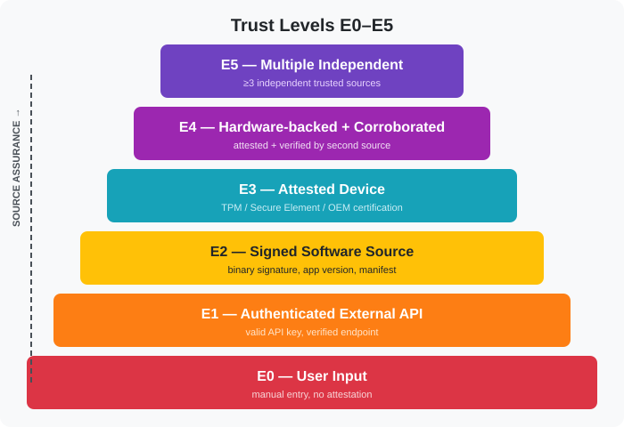

# LogiQED Trust Model

## Source Assurance

Source Assurance is a server-side evaluation of a source across seven dimensions:

1. Identity — who the source is
2. Authentication — how the source proves identity
3. Integrity — data validity through hashes and signatures
4. Attestation — hardware or software context confirmation
5. Metrology — calibration and accuracy
6. Time — clock accuracy and synchronization
7. Provenance — origin of the data

Each dimension is evaluated independently. The final level is a combination of dimensions, not a single value.

| Level | Description 								 |
|-------|--------------------------------------------|
| E0    | Manual input, basic authentication 		 |
| E1    | Authenticated external API 				 |
| E2    | Signed software source 					 |
| E3    | Attested device, TPM or Secure Element 	 |
| E4    | E3 plus corroboration with another source  |
| E5    | E4 plus three or more independent sources  |



## Trust Policy
```json
{
  "policyId": "E4_REQUIRED_V1",
  "version": 1,
  "minTrustLevel": "E4",
  "sources": ["device", "warehouse_api"],
  "corroboration": "REQUIRED",
  "acceptLowerWithWarning": false
}
```

A claim is valid only if all required sources satisfy the policy.

## Claim Confidence

Claim Confidence is the result of evaluating a specific claim against its Trust Policy.

Example:

- Source A: E4
- Source B: E2
- Policy: E4_REQUIRED_V1
- Result: FAIL

Source B does not satisfy the requirement.

## Provenance and Source Independence

Three sources are not necessarily independent.

GPS and geofence may derive from the same signal.

Rule: E5 is assigned only when the Evidence Graph confirms independence.

| Level | Requirement 														 |
|-------|--------------------------------------------------------------------|
| E4 	| Corroboration with another source 								 |
| E5 	| Three or more independent sources, confirmed in the Evidence Graph |

Independence is not just different SourceId values. It means the data does not come from the same physical sensor or signal.

## On-Demand Oracle and Trust

External APIs are called only when an incident occurs.

Each call adds a source to the claim.

The Enrichment Decider determines whether external confirmation is required.

## MVP Implementation

### Source Identity Model
```json
{
  "sourceId": "sensor_01HZ...",
  "keyId": "key_01HZ...",
  "sourceType": "TRACKER",
  "attestationType": "SECURE_ENCLAVE",
  "firmwareVersion": "1.2.0",
  "revocationStatus": "ACTIVE"
}
```

The server computes Source Assurance and Trust Policy result.

The client never supplies the trust level.

## Evaluation Process

1. Receive event.
2. Verify signature.
3. Check identity, key, and certificate.
4. Check attestation when available.
5. Build provenance.
6. Compute Source Assessment.
7. Apply Trust Policy.
8. Produce Claim Confidence.

## Result in Evidence Package

```json
{
  "trustPolicyResult": {
    "policyId": "E4_REQUIRED_V1",
    "version": 1,
    "result": "PASS",
    "evaluatedAt": "2026-08-27T15:00:00Z"
  },
  "sources": [
    {
      "sourceId": "device-042",
      "trustLevel": "E4",
      "attestation": "SECURE_ENCLAVE"
    },
    {
      "sourceId": "warehouse-api-01",
      "trustLevel": "E2"
    }
  ]
}
```

A verifier can check the trust policy result without raw telemetry.

## Design Principles

- Source Assurance is a server-side evaluation, not a client claim.
- The client never supplies the trust level.
- E5 requires independent sources confirmed in the Evidence Graph.
- Claim Confidence is the result of applying Trust Policy, not a separate number.
- Trust levels are combinations of dimensions, not a single value.