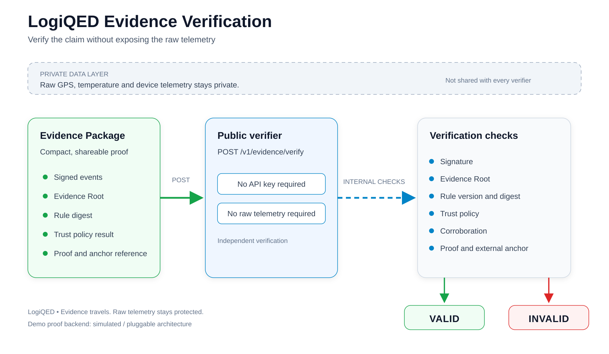

# LogiQED Verification



Verification allows any party to check an Evidence Package without accessing raw telemetry.

## What Can Be Verified

- Proof validity, when present
- Hash consistency for Trip and Claim Evidence Roots
- Source signatures
- Rule version and digest
- Trust policy result
- Claim level
- Decision: confirmed or rejected
- Corroboration result, when present
- Conclusion correctness
- Trip and Claim Evidence Roots against external anchors

## Endpoint

`POST /v1/evidence/verify`

## Authentication

Public endpoint. No API key required.

Unlike the ingest endpoint, verification does not use X-Telemetry-Key. It is open to any party.

Rate limit: 100 requests per minute per IP.

## Request

### Option A: by package ID

```json
    {
      "packageId": "pkg_01HZ..."
    }
```

### Option B: full package

```json
    {
      "package": {
        "schemaVersion": "1.0",
        "packageForm": "FULL",
        "claimId": "...",
        "claimType": "DETENTION",
        "claimLevel": "E4",
        "decision": "CONFIRMED",
        "sources": [],
        "inputEvents": [],
        "rule": {
          "id": "DETENTION_V1",
          "version": "1.0",
          "digest": "sha256:..."
        },
        "tripEvidenceRoot": "0x8f3a...",
        "claimEvidenceRoot": "0x4b12...",
        "proof": {
          "backend": "ALIGNED_LAYER_MOCK",
          "proofHash": "sha256:..."
        },
        "signature": "ed25519:..."
      }
    }
```

## Responses

### 200 Verified

```json
    {
      "requestId": "req_01HZ...",
      "packageId": "pkg_01HZ...",
      "schemaVersion": "1.0",
      "result": {
        "status": "VALID",
        "conclusion": "Warehouse attributable: 68 min"
      },
      "checks": {
        "signature": "PASS",
        "tripEvidenceRootMerkle": "PASS",
        "tripEvidenceRootAnchor": "PASS",
        "claimEvidenceRootMerkle": "PASS",
        "claimEvidenceRootAnchor": "PASS",
        "ruleDigest": "PASS",
        "trustPolicy": "PASS",
        "claimLevel": "PASS",
        "corroboration": "PASS",
        "proofValidity": "PASS"
      },
      "trustPolicy": {
        "id": "E4_REQUIRED_V1",
        "version": "1.0",
        "evaluationStatus": "PASS"
      },
      "rule": {
        "id": "DETENTION_V1",
        "version": "1.0",
        "digest": "sha256:..."
      },
      "claimLevel": "E4",
      "decision": "CONFIRMED",
      "tripEvidenceRoot": "0x8f3a...",
      "tripExternalAnchorRef": "arweave:kT4b...",
      "claimEvidenceRoot": "0x4b12...",
      "claimExternalAnchorRef": "arweave:kT4c...",
      "proof": {
        "backend": "ALIGNED_LAYER_MOCK",
        "circuitId": "detention_claim_v1",
        "version": "1.0",
        "valid": true
      },
      "verifiedAt": "2026-08-25T14:05:00Z"
    }
```

### 200 Invalid

```json
    {
      "requestId": "req_01HZ...",
      "packageId": "pkg_01HZ...",
      "schemaVersion": "1.0",
      "result": {
        "status": "INVALID",
        "reason": "Claim Evidence Root does not match Merkle commitment"
      },
      "checks": {
        "signature": "PASS",
        "tripEvidenceRootMerkle": "PASS",
        "tripEvidenceRootAnchor": "PASS",
        "claimEvidenceRootMerkle": "FAIL",
        "claimEvidenceRootAnchor": "PASS",
        "ruleDigest": "PASS",
        "trustPolicy": "PASS",
        "claimLevel": "PASS",
        "corroboration": "PASS",
        "proofValidity": "PASS"
      },
      "verifiedAt": "2026-08-25T14:05:00Z"
    }
```

### 200 Evidence Package Base

```json
    {
      "requestId": "req_01HZ...",
      "packageId": "pkg_01HZ...",
      "schemaVersion": "1.0",
      "packageForm": "BASE",
      "result": {
        "status": "VALID",
        "conclusion": "Warehouse attributable: 68 min"
      },
      "checks": {
        "signature": "PASS",
        "tripEvidenceRootMerkle": "PASS",
        "tripEvidenceRootAnchor": "PASS",
        "claimEvidenceRootMerkle": "PASS",
        "claimEvidenceRootAnchor": "PASS",
        "ruleDigest": "PASS",
        "trustPolicy": "PASS",
        "claimLevel": "PASS",
        "corroboration": "SKIP",
        "proofValidity": "SKIP"
      },
      "claimLevel": "E3",
      "decision": "CONFIRMED",
      "verifiedAt": "2026-08-25T14:05:00Z"
    }
```

The Evidence Package Base has no corroboration and no proof. Both checks return SKIP.

### 400 Invalid Request

```json
    {
      "requestId": "req_01HZ...",
      "error": {
        "code": "INVALID_PACKAGE",
        "message": "Neither packageId nor package provided"
      }
    }
```

### 404 Package Not Found

```json
    {
      "requestId": "req_01HZ...",
      "error": {
        "code": "PACKAGE_NOT_FOUND",
        "message": "Evidence Package not found"
      }
    }
```

### 429 Rate Limit Exceeded

```json
    {
      "requestId": "req_01HZ...",
      "error": {
        "code": "RATE_LIMITED",
        "message": "Rate limit exceeded. Try again in 60 seconds."
      }
    }
```

## Verification Steps

1. Resolve package by packageId or by full package payload.
2. Verify signature with the organization key.
3. Recompute Trip Evidence Root from canonical route events.
4. Verify trip anchor against tripExternalAnchorRef.
5. Recompute Claim Evidence Root from canonical claim events.
6. Verify claim anchor against claimExternalAnchorRef.
7. Verify rule digest from published rule definition.
8. Verify trust policy from source own assurance values.
9. Verify claim level matches the computed level.
10. Verify decision matches the recorded outcome.
11. Verify corroboration from Evidence Graph, when present.
12. Verify proof through the proof backend, when present.
13. Recompute conclusion from rule formula and input events.
14. Log verification with requestId, packageId, result, and verifiedAt.

## Design Notes

- Verification never exposes raw telemetry.
- verifiedAt is set by the server.
- Checks return PASS, FAIL, or SKIP.
- SKIP is used when a check is not applicable. For an Evidence Package Base, corroboration and proof are not present, so both checks return SKIP.
- ZK proof is present only in the Evidence Package Full, and only when the claim level is E3 or higher.
- Proof backend is pluggable: Aligned Layer, Groth16, Plonk, STARK, or zkVM options (Lattice Jolt, SP1, RISC Zero).
- Verification results are logged for audit.
- Aligned Layer is the primary proof backend. Mock for MVP.
- Any party can verify independently.