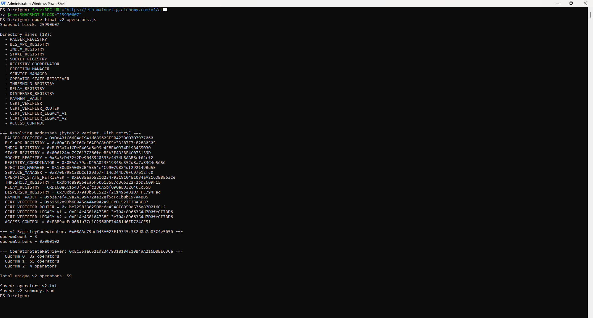
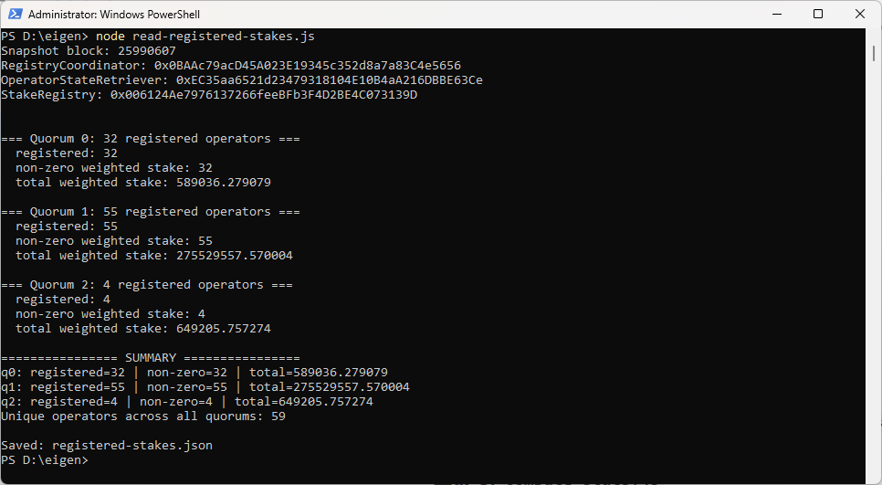
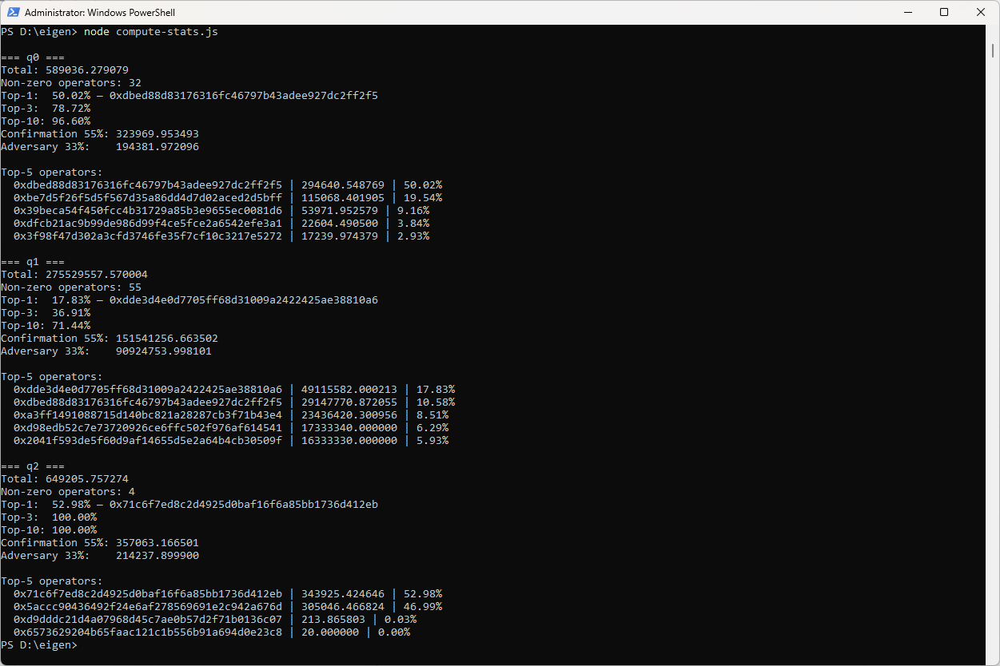
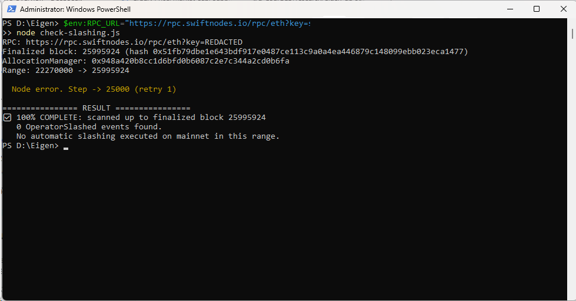
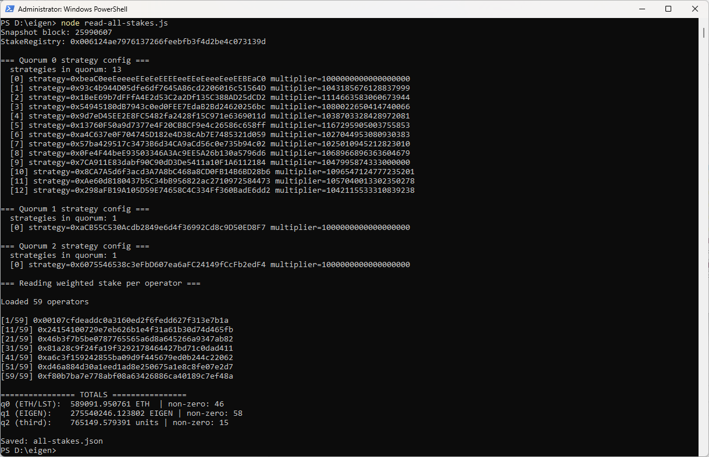
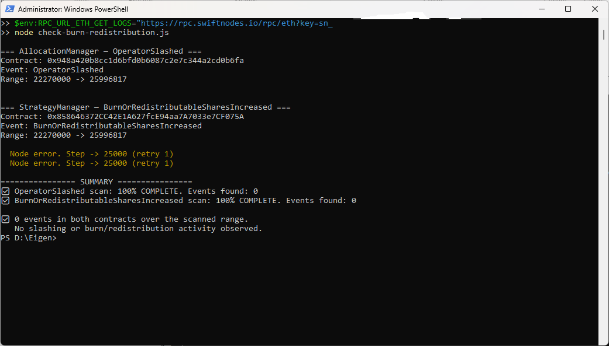
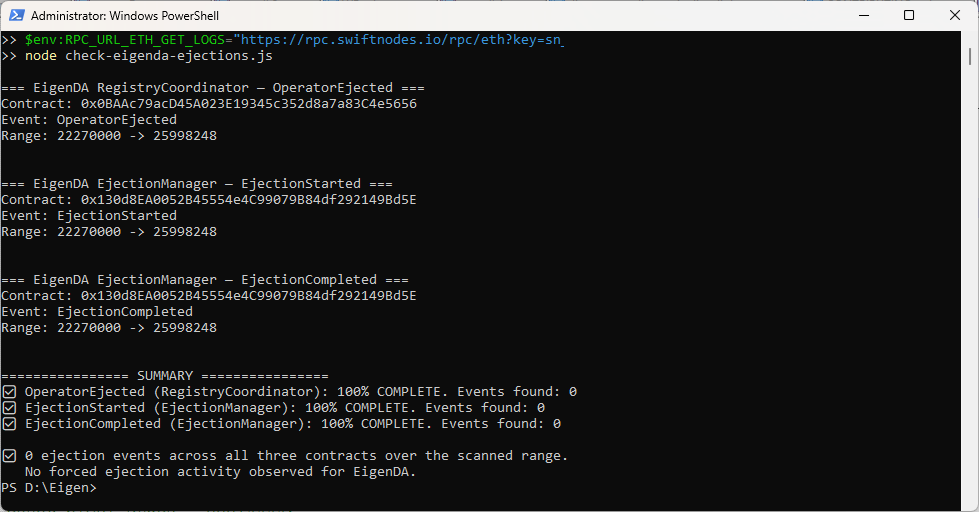

# EigenDA Security Budget Analysis

## On-chain research into AVS-level security accounting

**Snapshot date:** 2026-09-16

**Network:** Ethereum Mainnet

**Snapshot block:** 25,990,607

**Reference rates:** ETH = $2,400, EIGEN = $0.19

**Method:** Direct on-chain reads via official contracts

**Author:** Independent research

---

## Executive Summary

EigenDA is one of the largest AVSs in the EigenLayer ecosystem. This research measures its weighted quorum stake directly from on-chain contracts and checks whether that stake maps to confirmed slashable magnitudes through the inspected AllocationManager path.

**Key findings:**

- 59 active operators across 3 configured quorums: ETH/LST (32), EIGEN (55), and a third quorum (4).

- Weighted stake: 589,036 ETH-equivalent, 275,529,558 EIGEN-equivalent, and 649,206 units in the third quorum.

- Concentration in the ETH quorum is severe: one operator controls about 50.02% of weighted stake; top-3 operators control about 78.72%; top-10 operators control about 96.60%.

- The EIGEN quorum is also concentrated: top-1 controls about 17.83%, top-3 about 36.91%, and top-10 about 71.44% of weighted stake.

- Zero slashing and ejection events across four independent on-chain paths over 3.7 million blocks: OperatorSlashed (AllocationManager), BurnOrRedistributableSharesIncreased (StrategyManager), OperatorEjected (RegistryCoordinator), and EjectionStarted/EjectionCompleted (EjectionManager).

- EigenDA uses M2 middleware, not Operator Sets. Its weighted quorum stake could not be mapped to slashable magnitudes through the inspected AllocationManager path.

- The slashable economic backstop for EigenDA is not independently verifiable from public on-chain data.

---

## 1. Objective

Determine the real economic security budget of EigenDA and evaluate whether it can be independently priced from public data.

Only active operators with non-zero stake are counted. Zero-stake, deregistered, and abandoned addresses do not affect consensus and are excluded.

**Operator count note.** This research reports 59 unique operators with non-zero weighted stake at the snapshot block, across the three quorums of the inspected RegistryCoordinator. L2BEAT reports 71 operators for the same period. The two numbers are not contradictory; they reflect different definitions:

- registered operators (including zero-weight entries),

- operators visible through Eigen API,

- operators with non-zero effective weight,

- operators across selected quorums at a specific reference block.

This research uses on-chain non-zero weighted stake at block 25,990,607 as the operational definition.

**Revision note.** Earlier drafts differ from the current version in two methodological respects.

First, stake values were originally read from latest state without a fixed blockTag; current figures are read at fixed block 25,990,607.

Second, earlier drafts aggregated weighted stake across the union of all 59 operator addresses, which included residual weight in quorums where an operator was no longer registered; current figures are computed only for the set of operators returned by getOperatorState per quorum.

Both corrections change the reported totals and do not reflect a change in the underlying on-chain state.

---

## 2. Data sources

### 2.1 Contracts

| Contract | Address |
|---|---|
| EigenDADirectory | 0x64AB2e9A86FA2E183CB6f01B2D4050c1c2dFAad4 |
| RegistryCoordinator | 0x0BAAc79acD45A023E19345c352d8a7a83C4e5656 |
| StakeRegistry | 0x006124Ae7976137266feeBFb3F4D2BE4C073139D |
| OperatorStateRetriever | 0xEC35aa6521d23479318104E10B4aA216DBBE63Ce |
| ServiceManager | 0x870679E138bCdf293b7Ff14dD44b70FC97e12fc0 |
| AllocationManager | 0x948a420b8CC1d6BFd0B6087C2E7c344a2CD0b6fA |

### 2.2 Method

- `EigenDADirectory.getAllNames()` — enumerate registered contracts.

- `EigenDADirectory.getAddress(keccak256(name))` — resolve actual addresses.

- `OperatorStateRetriever.getOperatorState(coordinator, quorums, block)` — retrieve active operators per quorum.

- `StakeRegistry.weightOfOperatorForQuorum(quorum, operator)` — read weighted stake per operator.

- `AllocationManager` — scan for `OperatorSlashed` events over 3.7M blocks.

---

## 3. Quorums

RegistryCoordinator reports `quorumCount = 3` on the snapshot block. The standard EigenDA CertVerifier at `0x61692e93b6B045c444e942A91EcD1527F23A3FB7` declares `requiredQuorums = 0x0001` (quorums 0 and 1), with:

- `confirmationThreshold = 55`

- `adversaryThreshold = 33`

A valid certificate requires each required quorum (q0 and q1) to reach confirmationThreshold. The required quorums are jointly required, not independent alternatives — an attacker must cross the threshold in every required quorum simultaneously to forge a certificate.

| Quorum | Type | Operators | In required set |
|---|---|---:|---|
| q0 | ETH / LST | 32 | yes |
| q1 | EIGEN | 55 | yes |
| q2 | Third quorum (not in requiredQuorums) | 4 | no |
| **Unique total** | | **59** | |



*Registered operator set per quorum, resolved through EigenDADirectory and read via OperatorStateRetriever at block 25,990,607.*

Verifier relation: `requiredQuorums ⊆ blobQuorums ⊆ confirmedQuorums ⊆ signedQuorums`.

**Implications:**

- A valid certificate requires each required quorum (q0 and q1) to reach confirmationThreshold.

- A liveness attack requires preventing at least one required quorum from reaching confirmationThreshold.

- q2 exists in the RegistryCoordinator but is not part of the standard requiredQuorums for the inspected CertVerifier.

**Note on operator counts.** The per-quorum counts in the table above are the counts of operators returned by `getOperatorState` at block 25,990,607, which returns 32 / 55 / 4 for q0 / q1 / q2. All operators returned for these registered sets were independently verified to have non-zero weighted stake at the snapshot block. The union of the three registered sets is 59 unique addresses.

An earlier draft also reported 46 / 58 / 15 non-zero weights per quorum. That number came from reading `weightOfOperatorForQuorum` for the full 59-address universe across all three quorums, which includes operators that hold residual weight in a quorum they are no longer registered in. This research uses only the registered set, because only registered operators participate in the confirmation of a certificate.

---

## 4. Weighted stake per quorum

All figures below are weighted quorum units as returned by `StakeRegistry.weightOfOperatorForQuorum`. They are not necessarily equal to underlying token balances, because quorum strategy multipliers may scale the weight.

| Quorum | Total weighted stake | Operators (non-zero) |
|---|---:|---:|
| q0 (ETH/LST) | 589,036 ETH-equivalent units | 32 of 32 |
| q1 (EIGEN) | 275,529,558 EIGEN-equivalent units | 55 of 55 |
| q2 (third) | 649,206 units | 4 of 4 |

**Multiplier verification.** `StakeRegistry.strategyParamsByIndex(1, 0)` returns `multiplier = 1e18` for the EIGEN strategy. This confirms that 1 strategy share contributes weight equal to 1 share. It does not by itself establish that 1 strategy share equals 1 underlying EIGEN token. The underlying exchange rate (shares → EIGEN) is not verified in this research. Threshold values are therefore reported in weighted quorum units, which equal strategy shares under the inspected multiplier. USD figures in Section 7 are indicative and assume an exchange rate of 1.0 between strategy shares and EIGEN tokens.



*Weighted stake totals for registered operators only at block 25,990,607. Counts: 32 / 55 / 4 registered operators in q0 / q1 / q2.*

---

## 5. Concentration

### Quorum 0 (ETH/LST) — 589,036 weighted units

| Position | Share of weighted quorum stake | Address |
|---|---:|---|
| Top-1 | about 50.02% | 0xdbed88d83176316fc46797b43adee927dc2ff2f5 |
| Top-3 | about 78.72% | |
| Top-10 | about 96.60% | |

Top-1 operator holds 294,640 ETH-equivalent weighted units. Top-3 operators collectively hold 463,681 ETH-equivalent weighted units.

The top-1 operator alone is below `confirmationThreshold = 55`, but the top-3 collectively exceed both `confirmationThreshold` (55%) and `adversaryThreshold` (33%). The quorum's confirmation condition is substantially dependent on a small group of three operators.

### Quorum 1 (EIGEN) — 275,529,558 weighted units

| Position | Share of weighted quorum stake | Address |
|---|---:|---|
| Top-1 | about 17.83% | 0xdde3d4e0d7705ff68d31009a2422425ae38810a6 |
| Top-3 | about 36.91% | |
| Top-10 | about 71.44% | |

Top-1 operator holds 49,115,582 EIGEN-equivalent weighted units. Top-3 operators collectively hold 101,699,773 EIGEN-equivalent weighted units.

Distribution is more even than q0, but top-10 still control about 71% of weighted stake.

### Quorum 2 (third) — 649,206 weighted units

| Position | Share of weighted quorum stake | Address |
|---|---:|---|
| Top-1 | about 52.98% | 0x71c6f7ed8c2d4925d0baf16f6a85bb1736d412eb |
| Top-3 | about 100.00% | |
| Top-10 | about 100.00% | |

Quorum 2 is not part of the standard requiredQuorums for the inspected CertVerifier. It has only 4 registered operators, and the top-2 operators control about 99.97% of weighted stake. Concentration is severe even compared to q0.



*Per-quorum concentration from `compute-stats.js` at block 25,990,607. Top-1, top-3, and top-10 shares are computed over registered operators with non-zero weighted stake.*

---

## 6. Threshold exposure (weighted)

Thresholds below are computed from the on-chain weighted quorum units reported by StakeRegistry at block 25,990,607. They are not proven slashable amounts.

**On-chain CertVerifier parameters** (from the deployed EigenDA CertVerifier at 0x61692e93b6B045c444e942A91EcD1527F23A3FB7):

- `confirmationThreshold = 55`

- `adversaryThreshold = 33`

- `requiredQuorums = 0x0001` (q0 and q1)

### Quorum 0 (ETH) — 589,036 weighted units

| Threshold | Weighted units | Share |
|---|---:|---:|
| Confirmation 55% | 323,970 | 55% |
| Adversary 33% | 194,382 | 33% |

### Quorum 1 (EIGEN) — 275,529,558 weighted units

| Threshold | Weighted units | Share |
|---|---:|---:|
| Confirmation 55% | 151,541,257 | 55% |
| Adversary 33% | 90,924,754 | 33% |

**Notes:**

- Each required quorum (q0 and q1) must reach confirmationThreshold for a valid certificate. The quorums are not OR-alternatives.

- A pure quorum liveness failure occurs if less than confirmationThreshold of weighted stake signs in a required quorum. Equivalently, more than 45% of weighted stake is unavailable or withholding.

- The 33% adversaryThreshold is a separate EigenDA security parameter. It should not be interpreted as the liveness-blocking fraction.

- Safety attack: produce a valid certificate. This requires crossing confirmationThreshold in every required quorum simultaneously.

These are weighted quorum thresholds. They are not proven slashable amounts, because weighted stake is not the same as slashable stake.

---

## 7. Price sensitivity of the EIGEN quorum

The EIGEN strategy has `multiplier = 1e18` in the inspected StakeRegistry, verified via `strategyParamsByIndex(1, 0)`. This means 1 weighted unit in the EIGEN quorum corresponds to 1 strategy share. The exchange rate between strategy shares and underlying EIGEN tokens is not verified in this research and is assumed to be 1.0 for the indicative USD figures below. Under that assumption, the mark-to-market dollar value of the quorum threshold scales linearly with the market price of EIGEN.

The table below shows the confirmation (55%) and adversary (33%) thresholds of the EIGEN quorum at several EIGEN prices. All values are computed from the on-chain weighted stake at block 25,990,607.

| EIGEN price | Adversary 33% (90,924,754 shares) | Confirmation 55% (151,541,257 shares) |
|---|---:|---:|
| $0.10 | ~$9.1M | ~$15.2M |
| $0.19 (snapshot) | ~$17.3M | ~$28.8M |
| $0.50 | ~$45.5M | ~$75.8M |
| $1.00 | ~$90.9M | ~$151.5M |
| $2.00 | ~$181.8M | ~$303.1M |
| $3.00 | ~$272.8M | ~$454.6M |

**Interpretation:**

- The EIGEN quorum's dollar-denominated threshold is a direct function of the market price of EIGEN. It is not fixed by the protocol.

- A lower EIGEN price lowers the mark-to-market dollar value represented by a given quorum threshold, all else equal.

- A higher EIGEN price raises the mark-to-market dollar value represented by a given quorum threshold, all else equal.

- These figures should not be interpreted as the executable acquisition cost of controlling a quorum threshold. Acquiring the underlying stake in practice would involve market impact, liquidity constraints, operator registration, delegation, and time, none of which are captured here.

**Important caveats:**

- These figures represent weighted quorum thresholds. They are not proven slashable amounts. The relationship between weighted quorum stake and confirmed slashable magnitudes through the inspected AllocationManager path was not established in this research.

- The 33% adversaryThreshold is a separate EigenDA security parameter. It should not be interpreted as the liveness-blocking fraction (that is >45% unavailable stake in a required quorum).

- USD figures are indicative. ETH = $2,400, EIGEN = $0.19 at snapshot.

- If the EIGEN strategy exchange rate diverges from 1.0 in the future, the weighted units and EIGEN token amounts would no longer correspond 1:1, and the table would require recalculation.

---

## 8. Slashing check on AllocationManager

### Method

Scan AllocationManager (0x948a420b...b6fa) for OperatorSlashed events from slashing activation block (22,270,000) to the latest finalized block. Two independent complete runs were performed: one up to block 25,991,586 and one up to block 25,996,817. Both completed with status 100% COMPLETE.

Event signature:

```solidity
event OperatorSlashed(
    address indexed operator,
    bytes32 indexed operatorSet,
    address[] strategies,
    uint256[] wadSlashed,
    string description
);
```

### Result

```text
Run 1: 100% COMPLETE, scanned up to block 25,991,586
Run 2: 100% COMPLETE, scanned up to block 25,996,817

0 OperatorSlashed events found in either run.

Range: ~3.72 million blocks per run.
Slashing events: 0.
```



*Console output of `check-slashing.js` against EigenLayer mainnet: two independent complete runs, both returning 0 `OperatorSlashed` events.*

### Summary of on-chain checks

Four independent on-chain paths were scanned over the same range. All returned zero events.

| Path | Contract | Event | Events found |
|---|---|---|---|
| 1 | AllocationManager | `OperatorSlashed` | 0 |
| 2 | StrategyManager | `BurnOrRedistributableSharesIncreased` | 0 |
| 3 | RegistryCoordinator | `OperatorEjected` | 0 |
| 4 | EjectionManager | `EjectionStarted` / `EjectionCompleted` | 0 |

Paths 1 and 2 are slashing-related. Paths 3 and 4 describe governance actions for non-signing, not slashing enforcement.

### What this shows

- Slashing is technically enabled at the EigenLayer protocol level.

- It has never been executed on EigenDA or, in this scanned range, on any AVS whose events would appear in the same contract.

- EigenDA operates on M2 middleware, not on Operator Sets.

- Weighted stake in this path was not mapped to confirmed slashable magnitudes in this research.

---

## 9. Limitations

**1. Weighted stake is not slashable stake.**

This report measures voting weight in quorums, not slashable magnitudes in `AllocationManager`.

**2. Zero slashing-related events in the scanned range.**

Four independent paths were checked:

- `OperatorSlashed` (AllocationManager)

- `BurnOrRedistributableSharesIncreased` (StrategyManager)

- `OperatorEjected` (EigenDA RegistryCoordinator)

- `EjectionStarted` / `EjectionCompleted` (EigenDA EjectionManager)

All four returned zero events over the same range. Paths 1–2 are slashing-related; paths 3–4 describe governance actions for non-signing.

*This does not by itself prove that no M2-specific slashing or enforcement mechanism exists.*

**3. USD figures are indicative.**

ETH = $2,400, EIGEN = $0.19 at snapshot. Conversions scale linearly.

**4. RPC constraints.**

Two RPC classes were used:

- **Alchemy (free tier)** — `eth_call` reads on a fixed snapshot block.

- **SwiftNodes (free tier)** — `eth_getLogs` slashing scans with adaptive chunking.

Alchemy Free does not serve archive `eth_getLogs`. SwiftNodes returned non-deterministic results for some `eth_call` queries during initial development, and one intermediate slashing scan attempt did not complete due to RPC-level instability.

Two complete runs through SwiftNodes both finished with status **100% COMPLETE** and **0** `OperatorSlashed` events, at blocks **25,991,586** and **25,996,817** respectively. No change in on-chain data was observed between runs.

---

## 10. Conclusions

- EigenDA reports 59 active operators across three quorums in the inspected RegistryCoordinator. Comparative ranking against other AVSs was not performed.

- It runs three configured quorums: ETH/LST (q0), EIGEN (q1), and a third EigenDA-specific quorum (q2). q0 and q1 are jointly required for a standard certificate.

- The ETH quorum is severely concentrated: top-1 controls about **50.02%**, top-3 about **78.72%**, top-10 about **96.60%** of weighted stake.

- The EIGEN quorum is also concentrated: top-1 controls about **17.83%**, top-10 about **71.44%**.

- Zero `OperatorSlashed` events over 3.7M blocks — slashing has never been executed in this range.

- EigenDA runs on M2 middleware, not Operator Sets. No slashable allocation corresponding to the observed EigenDA quorum weights was identified through the inspected AllocationManager / Operator Sets path.

- The slashable economic backstop for EigenDA is not independently verifiable from public on-chain data.

---

## 11. What can be claimed

The inspected data exposes EigenDA's weighted quorum stake, but does not establish a verified slashable security budget.

Zero slashing-related events were observed across four independent paths over the scanned range:

- `OperatorSlashed` (AllocationManager)

- `BurnOrRedistributableSharesIncreased` (StrategyManager)

- `OperatorEjected` (RegistryCoordinator)

- `EjectionStarted` / `EjectionCompleted` (EjectionManager)

All four returned zero events.

*This does not by itself prove that no M2-specific slashing or enforcement mechanism exists.*

EigenDA's weighted quorum stake could not be mapped to slashable magnitudes through the inspected AllocationManager path.

---

## 12. What cannot be claimed

- **"EigenDA can be attacked for $11.8M."** Weighted stake is not slashable, so this is not proven.

- **"The economic barrier is $0."** Too categorical. The correct framing is "not slashable", not "zero".

- **"EIGEN quorum is N times cheaper than ETH quorum in real terms."** True only for weighted units, not for slashable magnitudes.

---

## 13. Reproducible scripts

### 13.1 Fetch operator set (final-v2-operators.js)

```javascript
'use strict';
const fs = require('node:fs');
const { ethers } = require('ethers');

const RPC_URL = process.env.RPC_URL;
if (!RPC_URL) throw new Error('Set RPC_URL');

const provider = new ethers.JsonRpcProvider(RPC_URL);

const SNAPSHOT_BLOCK = Number(process.env.SNAPSHOT_BLOCK || 25990607);
const DIRECTORY = '0x64AB2e9A86FA2E183CB6f01B2D4050c1c2dFAad4';

const DIRECTORY_ABI = [
  'function getAllNames() view returns (string[] memory)',
  'function getAddress(bytes32 key) view returns (address)',
  'function getAddress(string name) view returns (address)',
];

const REGISTRY_ABI = ['function quorumCount() view returns (uint8)'];

const RETRIEVER_ABI = [
  'function getOperatorState(address registryCoordinator, bytes quorumNumbers, uint32 blockNumber) view returns (tuple(address operator, bytes32 operatorId, uint96 stake)[][])',
];

const sleep = (ms) => new Promise((r) => setTimeout(r, ms));

async function retry(fn, label, attempts = 5) {
  for (let i = 1; i <= attempts; i++) {
    try {
      return await fn();
    } catch (e) {
      const msg = e.shortMessage || e.message;
      console.warn(`  ${label}: attempt ${i}/${attempts} failed — ${msg}`);
      if (i === attempts) throw e;
      // exponential backoff
      await sleep(1000 * i);
    }
  }
}

async function main() {
  console.log(`Snapshot block: ${SNAPSHOT_BLOCK}\n`);

  const dir = new ethers.Contract(DIRECTORY, DIRECTORY_ABI, provider);

  // getAllNames — without blockTag (read the current directory)
  const names = await retry(() => dir.getAllNames(), 'getAllNames');
  console.log(`Directory names (${names.length}):`);
  for (const n of names) console.log(`  - ${n}`);

  console.log('\n=== Resolving addresses (bytes32 variant, with retry) ===');
  const resolved = {};

  for (const name of names) {
    const key = ethers.keccak256(ethers.toUtf8Bytes(name));
    let addr = null;
    try {
      addr = await retry(
        () => dir['getAddress(bytes32)'](key),
        `getAddress(${name})`
      );
    } catch (e) {
      console.warn(`  ${name}: SKIPPED — ${e.shortMessage || e.message}`);
      addr = null;
    }
    resolved[name] = addr;
    console.log(`  ${name} = ${addr || 'ERROR'}`);
    await sleep(300); // small pause between requests
  }

  const rcAddr = resolved['REGISTRY_COORDINATOR'];
  if (!rcAddr || rcAddr.toLowerCase() === DIRECTORY.toLowerCase()) {
    console.error('\n❌ REGISTRY_COORDINATOR not resolved.');
    process.exit(1);
  }

  console.log(`\n=== v2 RegistryCoordinator: ${rcAddr} ===`);

  const coordinator = new ethers.Contract(rcAddr, REGISTRY_ABI, provider);
  const quorumCount = Number(
    await retry(
      () => coordinator.quorumCount({ blockTag: SNAPSHOT_BLOCK }),
      'quorumCount'
    )
  );
  console.log(`quorumCount = ${quorumCount}`);

  const quorumNumbers =
    '0x' +
    Array.from({ length: quorumCount }, (_, i) =>
      i.toString(16).padStart(2, '0')
    ).join('');
  console.log(`quorumNumbers = ${quorumNumbers}`);

  const retrieverAddr = resolved['OPERATOR_STATE_RETRIEVER'];
  if (!retrieverAddr) {
    console.error('\n❌ OPERATOR_STATE_RETRIEVER not resolved.');
    process.exit(1);
  }
  console.log(`\n=== OperatorStateRetriever: ${retrieverAddr} ===`);

  const retriever = new ethers.Contract(retrieverAddr, RETRIEVER_ABI, provider);
  const result = await retry(
    () => retriever.getOperatorState(rcAddr, quorumNumbers, SNAPSHOT_BLOCK),
    'getOperatorState'
  );

  const allOps = new Set();
  for (let q = 0; q < result.length; q++) {
    console.log(`  Quorum ${q}: ${result[q].length} operators`);
    for (const op of result[q]) allOps.add(op.operator.toLowerCase());
  }

  console.log(`\nTotal unique v2 operators: ${allOps.size}`);

  fs.writeFileSync('operators-v2.txt', Array.from(allOps).sort().join('\n'));
  fs.writeFileSync(
    'v2-summary.json',
    JSON.stringify(
      {
        snapshotBlock: SNAPSHOT_BLOCK,
        resolvedAddresses: resolved,
        registryCoordinator: rcAddr,
        operatorStateRetriever: retrieverAddr,
        quorumCount,
        totalUniqueOperators: allOps.size,
        operators: Array.from(allOps).sort(),
      },
      null,
      2
    )
  );

  console.log('\nSaved: operators-v2.txt');
  console.log('Saved: v2-summary.json');
}

main().catch((e) => {
  console.error('Fatal:', e.shortMessage || e.message);
  process.exitCode = 1;
});
```

### 13.2 Read weighted stakes (read-all-stakes.js)

```javascript
'use strict';
const fs = require('node:fs');
const { ethers } = require('ethers');

const RPC_URL = process.env.RPC_URL;
if (!RPC_URL) throw new Error('Set RPC_URL');

const provider = new ethers.JsonRpcProvider(RPC_URL);

// Fixed snapshot block for atomicity
const SNAPSHOT_BLOCK = Number(process.env.SNAPSHOT_BLOCK || 25990607);

const STAKE_REGISTRY = '0x006124ae7976137266feebfb3f4d2be4c073139d';

const ABI = [
  'function weightOfOperatorForQuorum(uint8 quorumNumber, address operator) view returns (uint96)',
  'function strategyParamsLength(uint8 quorumNumber) view returns (uint256)',
  'function strategyParamsByIndex(uint8 quorumNumber, uint256 index) view returns (tuple(address strategy, uint96 multiplier))',
];

const registry = new ethers.Contract(STAKE_REGISTRY, ABI, provider);

async function safeWeight(quorum, addr) {
  try {
    const v = await registry.weightOfOperatorForQuorum(quorum, addr, {
      blockTag: SNAPSHOT_BLOCK,
    });
    return BigInt(v);
  } catch {
    return null; // revert or error
  }
}

async function readQuorumConfig(quorum) {
  console.log(`\n=== Quorum ${quorum} strategy config ===`);
  let len = 0n;
  try {
    len = BigInt(
      await registry.strategyParamsLength(quorum, { blockTag: SNAPSHOT_BLOCK })
    );
  } catch (e) {
    console.log(`  strategyParamsLength failed: ${e.shortMessage || e.message}`);
    return;
  }

  console.log(`  strategies in quorum: ${len.toString()}`);

  for (let i = 0n; i < len; i++) {
    try {
      const p = await registry.strategyParamsByIndex(quorum, i, {
        blockTag: SNAPSHOT_BLOCK,
      });
      console.log(
        `  [${i}] strategy=${p.strategy} multiplier=${p.multiplier.toString()}`
      );
    } catch (e) {
      console.log(`  [${i}] failed: ${e.shortMessage || e.message}`);
    }
  }
}

async function main() {
  console.log(`Snapshot block: ${SNAPSHOT_BLOCK}`);
  console.log(`StakeRegistry: ${STAKE_REGISTRY}`);

  // 1. Read strategy config for all three quorums
  await readQuorumConfig(0);
  await readQuorumConfig(1);
  await readQuorumConfig(2);

  // 2. Read weighted stake per operator
  console.log(`\n=== Reading weighted stake per operator ===\n`);

  const lines = fs
    .readFileSync('operators.txt', 'utf8')
    .split('\n')
    .map((l) => l.trim())
    .filter((l) => l.startsWith('0x'));

  console.log(`Loaded ${lines.length} operators\n`);

  const results = [];
  for (let i = 0; i < lines.length; i++) {
    const addr = lines[i];
    const q0 = await safeWeight(0, addr);
    const q1 = await safeWeight(1, addr);
    const q2 = await safeWeight(2, addr);

    results.push({ address: addr, q0, q1, q2 });

    if (i % 10 === 0 || i === lines.length - 1) {
      console.log(`[${i + 1}/${lines.length}] ${addr}`);
    }
  }

  const valid = (field) =>
    results.filter((r) => r[field] !== null && r[field] > 0n);

  const totalQ0 = valid('q0').reduce((s, r) => s + r.q0, 0n);
  const totalQ1 = valid('q1').reduce((s, r) => s + r.q1, 0n);
  const totalQ2 = valid('q2').reduce((s, r) => s + r.q2, 0n);

  console.log('\n================ TOTALS ================');
  console.log(
    `q0 (ETH/LST):  ${(Number(totalQ0) / 1e18).toFixed(6)} ETH  | non-zero: ${valid('q0').length}`
  );
  console.log(
    `q1 (EIGEN):    ${(Number(totalQ1) / 1e18).toFixed(6)} EIGEN | non-zero: ${valid('q1').length}`
  );
  console.log(
    `q2 (third):    ${(Number(totalQ2) / 1e18).toFixed(6)} units | non-zero: ${valid('q2').length}`
  );

  fs.writeFileSync(
    'all-stakes.json',
    JSON.stringify(
      {
        snapshotBlock: SNAPSHOT_BLOCK,
        totals: {
          q0: totalQ0.toString(),
          q1: totalQ1.toString(),
          q2: totalQ2.toString(),
        },
        operators: results.map((r) => ({
          address: r.address,
          q0: r.q0 === null ? null : r.q0.toString(),
          q1: r.q1 === null ? null : r.q1.toString(),
          q2: r.q2 === null ? null : r.q2.toString(),
        })),
      },
      null,
      2
    )
  );

  console.log('\nSaved: all-stakes.json');
}

main().catch((e) => {
  console.error('Fatal:', e.shortMessage || e.message);
  process.exitCode = 1;
});
```

**Note on `all-stakes.json`.** The file stores q0 / q1 / q2 as raw wei-format strings. Divide by 1e18 to get human-readable amounts:

- ETH-equivalent for q0
- EIGEN-equivalent for q1
- units for q2

The same script also prints human-readable totals to stdout, so the JSON and console output are consistent. The JSON is the canonical artifact; the log is a convenience view.



*Weighted stake read across the full 59-address universe. This run is informational and includes residual weight in quorums where an operator is no longer registered. The canonical registered-only numbers are in Section 4 and Section 5. Both runs produce nearly identical totals, confirming that the choice of operator universe does not materially affect the reported concentration or thresholds.*

---

### 13.3 Read registered weighted stakes (read-registered-stakes.js)

```javascript
'use strict';
const fs = require('node:fs');
const { ethers } = require('ethers');

const RPC_URL = process.env.RPC_URL;
if (!RPC_URL) throw new Error('Set RPC_URL');

const provider = new ethers.JsonRpcProvider(RPC_URL);

// Fixed snapshot block for atomicity
const SNAPSHOT_BLOCK = Number(process.env.SNAPSHOT_BLOCK || 25990607);

const STAKE_REGISTRY = '0x006124Ae7976137266feeBFb3F4D2BE4C073139D';
const REGISTRY_COORDINATOR = '0x0BAAc79acD45A023E19345c352d8a7a83C4e5656';
const OPERATOR_STATE_RETRIEVER = '0xEC35aa6521d23479318104E10B4aA216DBBE63Ce';

const STAKE_REGISTRY_ABI = [
  'function weightOfOperatorForQuorum(uint8 quorumNumber, address operator) view returns (uint96)',
];

const RETRIEVER_ABI = [
  'function getOperatorState(address registryCoordinator, bytes quorumNumbers, uint32 blockNumber) view returns (tuple(address operator, bytes32 operatorId, uint96 stake)[][])',
];

const stakeRegistry = new ethers.Contract(STAKE_REGISTRY, STAKE_REGISTRY_ABI, provider);
const retriever = new ethers.Contract(OPERATOR_STATE_RETRIEVER, RETRIEVER_ABI, provider);

async function safeWeight(quorum, addr) {
  try {
    const v = await stakeRegistry.weightOfOperatorForQuorum(quorum, addr, {
      blockTag: SNAPSHOT_BLOCK,
    });
    return BigInt(v);
  } catch {
    return null; // revert or error
  }
}

function format18(x) {
  if (x === null) return 'null';
  return (Number(x) / 1e18).toFixed(6);
}

async function main() {
  console.log(`Snapshot block: ${SNAPSHOT_BLOCK}`);
  console.log(`RegistryCoordinator: ${REGISTRY_COORDINATOR}`);
  console.log(`OperatorStateRetriever: ${OPERATOR_STATE_RETRIEVER}`);
  console.log(`StakeRegistry: ${STAKE_REGISTRY}\n`);

  // 1. Read registered operators per quorum
  const quorumNumbers = '0x000102'; // q0, q1, q2
  const state = await retriever.getOperatorState(
    REGISTRY_COORDINATOR,
    quorumNumbers,
    SNAPSHOT_BLOCK
  );

  const perQuorum = [];

  for (let q = 0; q < state.length; q++) {
    const registered = state[q];
    console.log(`\n=== Quorum ${q}: ${registered.length} registered operators ===`);

    const operators = [];
    let total = 0n;

    for (const op of registered) {
      const weight = await safeWeight(q, op.operator);
      if (weight !== null && weight > 0n) {
        total += weight;
        operators.push({
          address: op.operator.toLowerCase(),
          operatorId: op.operatorId,
          registeredStake: op.stake.toString(),
          weightedStake: weight.toString(),
        });
      } else {
        operators.push({
          address: op.operator.toLowerCase(),
          operatorId: op.operatorId,
          registeredStake: op.stake.toString(),
          weightedStake: null,
        });
      }
    }

    const nonZero = operators.filter((o) => o.weightedStake !== null);
    console.log(`  registered: ${operators.length}`);
    console.log(`  non-zero weighted stake: ${nonZero.length}`);
    console.log(`  total weighted stake: ${format18(total)}`);

    perQuorum.push({
      quorum: q,
      registeredCount: operators.length,
      nonZeroCount: nonZero.length,
      totalWeightedStake: total.toString(),
      operators,
    });
  }

  // 2. Unique operators across all quorums
  const unique = new Set();
  for (const q of perQuorum) {
    for (const op of q.operators) unique.add(op.address);
  }

  console.log(`\n================ SUMMARY ================`);
  for (const q of perQuorum) {
    console.log(
      `q${q.quorum}: registered=${q.registeredCount} | non-zero=${q.nonZeroCount} | total=${format18(BigInt(q.totalWeightedStake))}`
    );
  }
  console.log(`Unique operators across all quorums: ${unique.size}`);

  // 3. Save artifact
  const artifact = {
    snapshotBlock: SNAPSHOT_BLOCK,
    registryCoordinator: REGISTRY_COORDINATOR,
    operatorStateRetriever: OPERATOR_STATE_RETRIEVER,
    stakeRegistry: STAKE_REGISTRY,
    perQuorum: perQuorum.map((q) => ({
      quorum: q.quorum,
      registeredCount: q.registeredCount,
      nonZeroCount: q.nonZeroCount,
      totalWeightedStake: q.totalWeightedStake,
      operators: q.operators,
    })),
    uniqueOperators: Array.from(unique).sort(),
  };

  fs.writeFileSync(
    'registered-stakes.json',
    JSON.stringify(artifact, null, 2)
  );

  console.log('\nSaved: registered-stakes.json');
}

main().catch((e) => {
  console.error('Fatal:', e.shortMessage || e.message);
  process.exitCode = 1;
});
```
**Note.** `registered-stakes.json` stores per-quorum totals as raw wei-format strings, and per-operator weighted stakes as raw wei-format strings.

Divide by 1e18 to get human-readable amounts.

The script also prints human-readable totals (in ETH / EIGEN / units) to stdout, so the JSON and log are consistent.

---

### 13.4 Slashing check (check-slashing.js)

```javascript
'use strict';
const { ethers } = require('ethers');

// Dedicated env var for eth_getLogs (SwiftNodes etc.)
// Falls back to RPC_URL if not set.
const RPC_URL = process.env.RPC_URL_ETH_GET_LOGS || process.env.RPC_URL;
if (!RPC_URL) throw new Error('Set RPC_URL_ETH_GET_LOGS (or RPC_URL)');

const provider = new ethers.JsonRpcProvider(RPC_URL);

const ALLOCATION_MANAGER = '0x948a420b8cc1d6bfd0b6087c2e7c344a2cd0b6fa';

// Full range: from slashing activation block to current finalized block
const START_BLOCK = 22270000;

const ABI = [
  'event OperatorSlashed(address indexed operator, bytes32 indexed operatorSet, address[] strategies, uint256[] wadSlashed, string description)',
];

const sleep = (ms) => new Promise((r) => setTimeout(r, ms));

async function main() {
  const finalized = await provider.getBlock('finalized');
  const currentBlock = finalized.number;

  console.log(`RPC: ${RPC_URL.replace(/(key|apikey|api_key)=[^&]+/i, '$1=REDACTED')}`);
  console.log(`Finalized block: ${currentBlock} (hash ${finalized.hash})`);
  console.log(`AllocationManager: ${ALLOCATION_MANAGER}`);
  console.log(`Range: ${START_BLOCK} -> ${currentBlock}\n`);

  const contract = new ethers.Contract(ALLOCATION_MANAGER, ABI, provider);

  let step = 10000;
  const MIN_STEP = 100;
  let total = 0;
  const found = [];
  let isFullyCompleted = false;

  let from = START_BLOCK;
  let retriesAtCurrent = 0;
  const MAX_RETRIES_PER_WINDOW = 30;

  while (from <= currentBlock) {
    const to = Math.min(from + step - 1, currentBlock);

    try {
      const events = await contract.queryFilter('OperatorSlashed', from, to);

      if (events.length > 0) {
        total += events.length;
        for (const e of events) {
          found.push({
            block: e.blockNumber,
            operator: e.args.operator,
            operatorSet: e.args.operatorSet,
            description: e.args.description,
            tx: e.transactionHash,
          });
        }
        console.log(`  [${from}-${to}] found ${events.length}`);
      }

      if (to === currentBlock) isFullyCompleted = true;

      from = to + 1;
      step = Math.min(step * 2, 50000);
      retriesAtCurrent = 0;

      // Small delay to avoid hammering the RPC
      await sleep(50);
    } catch (e) {
      retriesAtCurrent++;
      const msg = e.shortMessage || e.message;

      if (retriesAtCurrent > MAX_RETRIES_PER_WINDOW) {
        console.error(
          `  Too many retries at ${from}-${to} (${retriesAtCurrent}). Aborting.`
        );
        console.error(`  Last error: ${msg}`);
        break;
      }

      if (step > MIN_STEP) {
        // Reduce window size on range limit errors
        step = Math.max(Math.floor(step / 2), MIN_STEP);
        console.warn(`  Node error. Step -> ${step} (retry ${retriesAtCurrent})`);
        await sleep(500 * Math.min(retriesAtCurrent, 10));
        continue;
      }

      // At minimum step: one last attempt before giving up
      console.error(`  Fatal at ${from}-${to}: ${msg}`);
      await sleep(2000);
      try {
        const events = await contract.queryFilter('OperatorSlashed', from, to);
        total += events.length;
        if (to === currentBlock) isFullyCompleted = true;
        from = to + 1;
        retriesAtCurrent = 0;
        continue;
      } catch (e2) {
        console.error(`  Fatal retry also failed: ${e2.shortMessage || e2.message}`);
        break;
      }
    }
  }

  console.log('\n================ RESULT ================');
  if (!isFullyCompleted) {
    console.log('❌ SCAN INTERRUPTED: result is NOT complete.');
    console.log(`   Scanned up to block ${from}. Target was ${currentBlock}.`);
  } else if (total === 0) {
    console.log(`✅ 100% COMPLETE: scanned up to finalized block ${currentBlock}`);
    console.log('   0 OperatorSlashed events found.');
    console.log('   No automatic slashing executed on mainnet in this range.');
  } else {
    console.log(`🚨 Found ${total} slashing events:`);
    for (const f of found) {
      console.log(`   Block ${f.block} | ${f.operator} | ${f.description}`);
    }
  }
}

main().catch((e) => {
  console.error('Fatal:', e.shortMessage || e.message);
  process.exitCode = 1;
});
```

### 13.5 Burn / redistribution check (check-burn-redistribution.js)

```javascript
'use strict';
const { ethers } = require('ethers');

const RPC_URL = process.env.RPC_URL_ETH_GET_LOGS || process.env.RPC_URL;
if (!RPC_URL) throw new Error('Set RPC_URL_ETH_GET_LOGS (or RPC_URL)');

const provider = new ethers.JsonRpcProvider(RPC_URL);

const ALLOCATION_MANAGER = '0x948a420b8cc1d6bfd0b6087c2e7c344a2cd0b6fa';
const STRATEGY_MANAGER = '0x858646372CC42E1A627fcE94aa7A7033e7CF075A';

const START_BLOCK = 22270000;

const ABI = [
  'event OperatorSlashed(address indexed operator, bytes32 indexed operatorSet, address[] strategies, uint256[] wadSlashed, string description)',
  'event BurnOrRedistributableSharesIncreased(bytes32 indexed operatorSetKey, uint256 indexed slashId, address indexed strategy, uint256 shares)',
];

const allocationManager = new ethers.Contract(ALLOCATION_MANAGER, ABI, provider);
const strategyManager = new ethers.Contract(STRATEGY_MANAGER, ABI, provider);

const sleep = (ms) => new Promise((r) => setTimeout(r, ms));

async function scanContract(contract, eventName, label) {
  const finalized = await provider.getBlock('finalized');
  const currentBlock = finalized.number;

  console.log(`\n=== ${label} ===`);
  console.log(`Contract: ${contract.target}`);
  console.log(`Event: ${eventName}`);
  console.log(`Range: ${START_BLOCK} -> ${currentBlock}\n`);

  let step = 10000;
  const MIN_STEP = 100;
  let total = 0;
  let isFullyCompleted = false;

  let from = START_BLOCK;
  let retriesAtCurrent = 0;
  const MAX_RETRIES_PER_WINDOW = 30;

  while (from <= currentBlock) {
    const to = Math.min(from + step - 1, currentBlock);

    try {
      const events = await contract.queryFilter(eventName, from, to);
      if (events.length > 0) total += events.length;
      if (to === currentBlock) isFullyCompleted = true;

      from = to + 1;
      step = Math.min(step * 2, 50000);
      retriesAtCurrent = 0;
      await sleep(50);
    } catch (e) {
      retriesAtCurrent++;
      if (retriesAtCurrent > MAX_RETRIES_PER_WINDOW) break;
      if (step > MIN_STEP) {
        step = Math.max(Math.floor(step / 2), MIN_STEP);
        await sleep(500 * Math.min(retriesAtCurrent, 10));
        continue;
      }
      break;
    }
  }

  return { total, isFullyCompleted, lastScanned: from, currentBlock };
}

async function main() {
  const slashed = await scanContract(allocationManager, 'OperatorSlashed', 'AllocationManager — OperatorSlashed');
  const burned = await scanContract(strategyManager, 'BurnOrRedistributableSharesIncreased', 'StrategyManager — BurnOrRedistributableSharesIncreased');

  console.log('\n================ SUMMARY ================');

  if (!slashed.isFullyCompleted) {
    console.log(`❌ OperatorSlashed scan: SCAN INTERRUPTED at block ${slashed.lastScanned}`);
  } else {
    console.log(`✅ OperatorSlashed scan: 100% COMPLETE. Events found: ${slashed.total}`);
  }

  if (!burned.isFullyCompleted) {
    console.log(`❌ BurnOrRedistributableSharesIncreased scan: SCAN INTERRUPTED at block ${burned.lastScanned}`);
  } else {
    console.log(`✅ BurnOrRedistributableSharesIncreased scan: 100% COMPLETE. Events found: ${burned.total}`);
  }

  if (slashed.isFullyCompleted && burned.isFullyCompleted && slashed.total === 0 && burned.total === 0) {
    console.log('\n✅ 0 events in both contracts over the scanned range.');
    console.log('   No slashing or burn/redistribution activity observed.');
  } else if (slashed.isFullyCompleted && burned.isFullyCompleted) {
    console.log('\n⚠️ Non-zero events found. Manual review required.');
  } else {
    console.log('\n❌ At least one scan did not complete. Results are NOT valid.');
  }
}

main().catch((e) => {
  console.error('Fatal:', e.shortMessage || e.message);
  process.exitCode = 1;
});
```

**Note.** This script is a secondary check. `BurnOrRedistributableSharesIncreased` is emitted by StrategyManager whenever slashed shares are routed to burn or redistribution.

A zero result here confirms that no slashing-related share removal occurred for any operator set over the scanned range.



*Console output of `check-burn-redistribution.js`: two complete runs, 0 events in both AllocationManager and StrategyManager.*

### 13.6 Eigenda ejections check (check-eigenda-ejections.js)

```javascript
'use strict';
const { ethers } = require('ethers');

const RPC_URL = process.env.RPC_URL_ETH_GET_LOGS || process.env.RPC_URL;
if (!RPC_URL) throw new Error('Set RPC_URL_ETH_GET_LOGS (or RPC_URL)');

const provider = new ethers.JsonRpcProvider(RPC_URL);

// EigenDA mainnet contracts
const EIGENDA_REGISTRY_COORDINATOR = '0x0BAAc79acD45A023E19345c352d8a7a83C4e5656';
const EIGENDA_EJECTION_MANAGER = '0x130d8EA0052B45554e4C99079B84df292149Bd5E';

const START_BLOCK = 22270000;

const ABI = [
  // EigenDA RegistryCoordinator
  'event OperatorEjected(address indexed operator, bytes32 indexed operatorId)',
  // EigenDA EjectionManager
  'event EjectionStarted(address indexed operator, bytes32 indexed operatorId)',
  'event EjectionCompleted(address indexed operator, bytes32 indexed operatorId)',
];

const registryCoordinator = new ethers.Contract(EIGENDA_REGISTRY_COORDINATOR, ABI, provider);
const ejectionManager = new ethers.Contract(EIGENDA_EJECTION_MANAGER, ABI, provider);

const sleep = (ms) => new Promise((r) => setTimeout(r, ms));

async function scanContract(contract, eventName, label) {
  const finalized = await provider.getBlock('finalized');
  const currentBlock = finalized.number;

  console.log(`\n=== ${label} ===`);
  console.log(`Contract: ${contract.target}`);
  console.log(`Event: ${eventName}`);
  console.log(`Range: ${START_BLOCK} -> ${currentBlock}\n`);

  let step = 10000;
  const MIN_STEP = 100;
  let total = 0;
  let isFullyCompleted = false;

  let from = START_BLOCK;
  let retriesAtCurrent = 0;
  const MAX_RETRIES_PER_WINDOW = 30;

  while (from <= currentBlock) {
    const to = Math.min(from + step - 1, currentBlock);

    try {
      const events = await contract.queryFilter(eventName, from, to);
      if (events.length > 0) {
        total += events.length;
        console.log(`  [${from}-${to}] found ${events.length}`);
        for (const e of events) {
          console.log(`    Block ${e.blockNumber} | operator=${e.args[0]} | tx=${e.transactionHash}`);
        }
      }
      if (to === currentBlock) isFullyCompleted = true;

      from = to + 1;
      step = Math.min(step * 2, 50000);
      retriesAtCurrent = 0;
      await sleep(50);
    } catch (e) {
      retriesAtCurrent++;
      if (retriesAtCurrent > MAX_RETRIES_PER_WINDOW) break;
      if (step > MIN_STEP) {
        step = Math.max(Math.floor(step / 2), MIN_STEP);
        await sleep(500 * Math.min(retriesAtCurrent, 10));
        continue;
      }
      break;
    }
  }

  return { total, isFullyCompleted, lastScanned: from, currentBlock };
}

async function main() {
  const ejected = await scanContract(
    registryCoordinator,
    'OperatorEjected',
    'EigenDA RegistryCoordinator — OperatorEjected'
  );

  const ejectionStarted = await scanContract(
    ejectionManager,
    'EjectionStarted',
    'EigenDA EjectionManager — EjectionStarted'
  );

  const ejectionCompleted = await scanContract(
    ejectionManager,
    'EjectionCompleted',
    'EigenDA EjectionManager — EjectionCompleted'
  );

  console.log('\n================ SUMMARY ================');

  const checks = [
    { name: 'OperatorEjected (RegistryCoordinator)', res: ejected },
    { name: 'EjectionStarted (EjectionManager)', res: ejectionStarted },
    { name: 'EjectionCompleted (EjectionManager)', res: ejectionCompleted },
  ];

  let allCompleted = true;
  let totalEvents = 0;

  for (const c of checks) {
    if (!c.res.isFullyCompleted) {
      console.log(`❌ ${c.name}: SCAN INTERRUPTED at block ${c.res.lastScanned}`);
      allCompleted = false;
    } else {
      console.log(`✅ ${c.name}: 100% COMPLETE. Events found: ${c.res.total}`);
      totalEvents += c.res.total;
    }
  }

  if (allCompleted && totalEvents === 0) {
    console.log('\n✅ 0 ejection events across all three contracts over the scanned range.');
    console.log('   No forced ejection activity observed for EigenDA.');
  } else if (allCompleted) {
    console.log('\n⚠️ Non-zero ejection events found. Manual review required.');
  } else {
    console.log('\n❌ At least one scan did not complete. Results are NOT valid.');
  }
}

main().catch((e) => {
  console.error('Fatal:', e.shortMessage || e.message);
  process.exitCode = 1;
});
```

**Note.** This script is an EigenDA-specific check. `OperatorEjected` in the EigenDA RegistryCoordinator and `EjectionStarted` / `EjectionCompleted` in the EigenDA EjectionManager describe governance actions for non-signing operators, not slashing enforcement.

A zero result here confirms that no forced ejection has been applied to EigenDA operators in the scanned range. This is orthogonal to the slashing checks in AllocationManager and StrategyManager.



*Console output of `check-eigenda-ejections.js`: three complete scans, 0 events in RegistryCoordinator and EjectionManager.*


### 13.7 Compute concentration and thresholds (compute-stats.js)

```javascript
'use strict';
const fs = require('node:fs');

const data = JSON.parse(fs.readFileSync('registered-stakes.json', 'utf8'));

function toEther(x) {
  return Number(BigInt(x)) / 1e18;
}

function formatPct(part, total) {
  return ((part / total) * 100).toFixed(2) + '%';
}

function statsForQuorum(quorum) {
  const q = data.perQuorum.find((x) => x.quorum === quorum);

  const rows = q.operators
    .map((op) => ({
      address: op.address,
      value: op.weightedStake === null ? 0n : BigInt(op.weightedStake),
    }))
    .filter((r) => r.value > 0n)
    .sort((a, b) => (a.value === b.value ? 0 : a.value > b.value ? -1 : 1));

  const total = rows.reduce((s, r) => s + r.value, 0n);

  const top1 = rows.slice(0, 1).reduce((s, r) => s + r.value, 0n);
  const top3 = rows.slice(0, 3).reduce((s, r) => s + r.value, 0n);
  const top10 = rows.slice(0, 10).reduce((s, r) => s + r.value, 0n);

  console.log(`\n=== q${quorum} ===`);
  console.log(`Total: ${toEther(total).toFixed(6)}`);
  console.log(`Non-zero operators: ${rows.length}`);
  console.log(`Top-1:  ${formatPct(Number(top1), Number(total))} — ${rows[0].address}`);
  console.log(`Top-3:  ${formatPct(Number(top3), Number(total))}`);
  console.log(`Top-10: ${formatPct(Number(top10), Number(total))}`);

  const conf55 = (total * 55n) / 100n;
  const adv33 = (total * 33n) / 100n;
  console.log(`Confirmation 55%: ${toEther(conf55).toFixed(6)}`);
  console.log(`Adversary 33%:    ${toEther(adv33).toFixed(6)}`);

  console.log('\nTop-5 operators:');
  for (const r of rows.slice(0, 5)) {
    console.log(`  ${r.address} | ${toEther(r.value).toFixed(6)} | ${formatPct(Number(r.value), Number(total))}`);
  }
}

statsForQuorum(0);
statsForQuorum(1);
statsForQuorum(2);
```
**Note.** `compute-stats.js` reads `registered-stakes.json` and produces the concentration and threshold values shown in Section 5 and Section 6.

It does not query the chain. It operates on the artifact produced by `read-registered-stakes.js`.

### 13.8 How to run

Install dependencies first:

```bash
npm install ethers
```

Two RPC types are needed for this research.

#### 1. For eth_call reads (operator set, weighted stake)

Linux / macOS:
```bash
export RPC_URL="https://eth-mainnet.g.alchemy.com/v2/YOUR_ALCHEMY_KEY"
export SNAPSHOT_BLOCK="25990607"
node final-v2-operators.js
node read-all-stakes.js
node read-registered-stakes.js
node compute-stats.js
```

Windows PowerShell:
```powershell
$env:RPC_URL="https://eth-mainnet.g.alchemy.com/v2/YOUR_ALCHEMY_KEY"
$env:SNAPSHOT_BLOCK="25990607"
node final-v2-operators.js
node read-all-stakes.js
node read-registered-stakes.js
node compute-stats.js
```

Windows CMD:
```cmd
set RPC_URL=https://eth-mainnet.g.alchemy.com/v2/YOUR_ALCHEMY_KEY
set SNAPSHOT_BLOCK=25990607
node final-v2-operators.js
node read-all-stakes.js
node read-registered-stakes.js
node compute-stats.js
```

#### 2. For eth_getLogs on archive blocks (slashing scan)

Free public RPCs that do not restrict eth_getLogs on archive blocks are required for this step. Alchemy Free does not serve archive eth_getLogs, so a different endpoint must be used.

Linux / macOS:
```bash
export RPC_URL_ETH_GET_LOGS="https://rpc.swiftnodes.io/rpc/eth?key=YOUR_KEY"
node check-slashing.js
node check-burn-redistribution.js
node check-eigenda-ejections.js
```

Windows PowerShell:
```powershell
$env:RPC_URL_ETH_GET_LOGS="https://rpc.swiftnodes.io/rpc/eth?key=YOUR_KEY"
node check-slashing.js
node check-burn-redistribution.js
node check-eigenda-ejections.js
```

Windows CMD:
```cmd
set RPC_URL_ETH_GET_LOGS=https://rpc.swiftnodes.io/rpc/eth?key=YOUR_KEY
node check-slashing.js
node check-burn-redistribution.js
node check-eigenda-ejections.js
```

Replace `YOUR_KEY` with a free SwiftNodes API key.

#### Reproducibility notes

**Snapshot.** Set `SNAPSHOT_BLOCK=25990607` for a reproducible snapshot. Without it, `final-v2-operators.js` and `read-all-stakes.js` default to block 25,990,607.

**RPC stability.** During initial development, all three scripts were run through SwiftNodes. Repeat runs of `read-all-stakes.js` through SwiftNodes returned non-deterministic results for the same block, indicating incomplete responses for some `eth_call` queries.

All `eth_call` figures in this report were recomputed and verified through Alchemy with two consecutive identical runs.

**Slashing scan.** The scan was performed through SwiftNodes. Two complete runs finished with status **100% COMPLETE** and **0** `OperatorSlashed` events, at blocks **25,991,586** and **25,996,817**.

An intermediate attempt through the same endpoint did not complete due to RPC-level instability, documented in Section 9 as an RPC constraint.

The two successful runs confirm that the reported result is stable across endpoints and time.

---

## 14. Artifacts

| File | Description |
|---|---|
| [operators.txt](./data/operators.txt) | 59 operator addresses with non-zero stake |
| [v2-summary.json](./data/v2-summary.json) | Resolved contract addresses and quorum snapshot |
| [all-stakes.json](./data/all-stakes.json) | Weighted stake per operator per quorum (all 59 addresses) |
| [registered-stakes.json](./data/registered-stakes.json) | Weighted stake per registered operator per quorum |
| [check-burn-redistribution-output.txt](./data/check-burn-redistribution-output.txt) | Console output of the burn/redistribution scan |
| [final-v2-operators.js](./scripts/final-v2-operators.js) | Resolve v2 contracts and fetch operator set |
| [read-all-stakes.js](./scripts/read-all-stakes.js) | Read weighted stake via StakeRegistry (all 59 addresses) |
| [read-registered-stakes.js](./scripts/read-registered-stakes.js) | Read weighted stake for registered operators only |
| [check-slashing.js](./scripts/check-slashing.js) | `OperatorSlashed` event scanner |
| [check-burn-redistribution.js](./scripts/check-burn-redistribution.js) | Secondary slashing check (StrategyManager burn/redistribution) |
| [check-eigenda-ejections.js](./scripts/check-eigenda-ejections.js) | EigenDA-specific ejection check (RegistryCoordinator + EjectionManager) |
| [compute-stats.js](./scripts/compute-stats.js) | Compute concentration and thresholds from `registered-stakes.json` |
| [images/](./images/) | Console screenshots: final-v2-operators, read-registered-stakes, compute-stats, check-slashing, check-burn-redistribution, check-eigenda-ejections, read-all-stakes |

---

## 15. Core claim

EigenDA's AVS-level slashable economic backstop could not be independently verified from the inspected public contracts and event history.

The analysis identified **589,036 ETH-equivalent** and **275,529,558 EIGEN-equivalent** weighted units across three quorums at block 25,990,607, but could not map that stake to confirmed slashable magnitudes.

Over 3.7 million blocks scanned, four independent on-chain paths all returned zero events:

| Path | Contract | Event |
|---|---|---|
| 1 | AllocationManager | `OperatorSlashed` |
| 2 | StrategyManager | `BurnOrRedistributableSharesIncreased` |
| 3 | RegistryCoordinator | `OperatorEjected` |
| 4 | EjectionManager | `EjectionStarted` / `EjectionCompleted` |

EigenDA runs on M2 middleware rather than the inspected Operator Sets path, so its active enforcement mechanism requires further verification.

---

**Snapshot block:** 25,990,607 (2026-09-16).

**Slashing-related scan finalized blocks:** 25,991,586, 25,996,817, 25,998,248 (three complete runs across four paths).

**Snapshot rates:** ETH = $2,400, EIGEN = $0.19.

**Multiplier (EIGEN strategy, q1):** 1e18 (1.0), verified on-chain via `StakeRegistry.strategyParamsByIndex(1, 0)`.

This research is reproducible. All contracts, blocks, and scripts are listed above. Readers are encouraged to independently verify the on-chain data.
